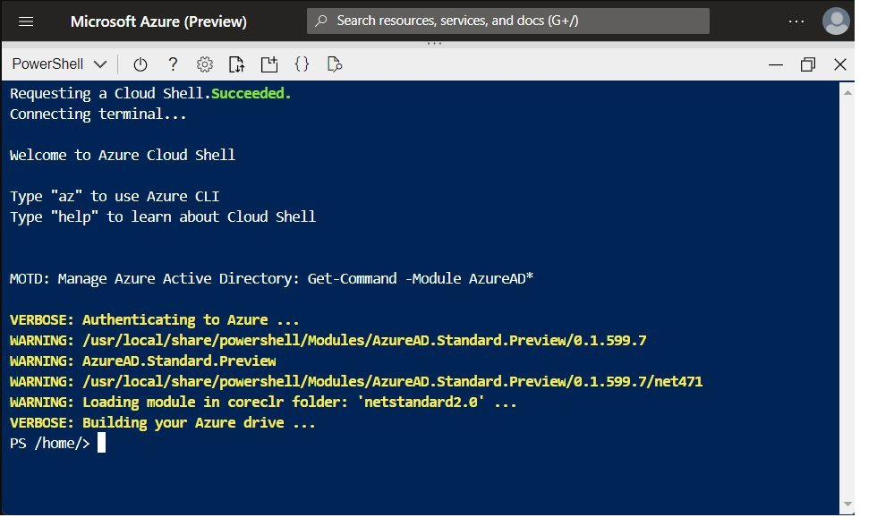

# Modulo 1 — Prerequisiti per gli amministratori di Azure

_Questo percorso introduce i fondamenti operativi per lavorare come amministratore di Microsoft Azure,
con focus sugli strumenti di gestione interattiva e sull'automazione dell'infrastruttura tramite template dichiarativi._

**Immagini usate in questo modulo:**
- `img/cloud-shell-powershell.png` (955×576) — Figura 1

**Tabelle generate da codice:**
- `toolsTable()` — Tabella 1: Strumenti disponibili in Cloud Shell
- `armStructureTable()` — Tabella 2: Elementi di un file modello ARM

---

## 1.1 — Introduzione ad Azure Cloud Shell
_(h2: Calibri 14pt grassetto #0078D4 keepNext)_

### 1.1.1 — Introduzione
_(h3: Calibri 12pt grassetto #2D5F8A keepNext)_

Come amministratore di Azure capita spesso di dover eseguire comandi o script di gestione da postazioni diverse — il proprio PC, un computer condiviso, un tablet — senza avere installati Azure CLI o Azure PowerShell. Azure Cloud Shell risolve questo problema offrendo una shell pronta all'uso, già autenticata e accessibile dal browser, senza alcuna configurazione locale.

In questa sezione vedrai che cos'è Cloud Shell, come funziona il suo ambiente (container temporaneo, strumenti preinstallati e archiviazione persistente) e in quali situazioni conviene usarlo rispetto a un'installazione locale degli strumenti.

### 1.1.2 — Che cos'è Azure Cloud Shell?
_(h3: Calibri 12pt grassetto #2D5F8A keepNext)_

Azure Cloud Shell è un ambiente shell interattivo e autenticato accessibile direttamente dal browser, senza necessità di installare nulla in locale. Supporta sia Bash che PowerShell e si integra nativamente con la sottoscrizione Azure dell'utente.

 _(dimensioni: 955×576 px)_

*Figura 1 — Sessione di Azure Cloud Shell in modalità PowerShell all'interno del portale di Azure.* _(caption)_

### 1.1.3 — Come funziona Azure Cloud Shell?
_(h3: Calibri 12pt grassetto #2D5F8A keepNext)_

- Viene eseguita in un container temporaneo su un host gestito da Microsoft.
- Ogni sessione riceve un ambiente fresco; i file persistono solo nel File Share di Azure collegato (Azure CloudDrive).
- Ha accesso diretto agli strumenti pre-installati: Azure CLI, Azure PowerShell, kubectl, Terraform, git e molti altri.
- L'autenticazione è automatica tramite le credenziali della sessione Azure già attiva.

### 1.1.4 — Quando è consigliabile usare Azure Cloud Shell?
_(h3: Calibri 12pt grassetto #2D5F8A keepNext)_

Cloud Shell è la scelta ideale quando si lavora da un dispositivo senza strumenti Azure installati, si vogliono eseguire script occasionali senza configurare un ambiente locale, oppure si desidera un accesso rapido e sicuro alla CLI da qualsiasi browser.

[TABELLA: toolsTable] _(tabella generata da codice)_

*Tabella 1 — Strumenti disponibili in una sessione Cloud Shell.* _(caption)_

---

## 1.2 — Distribuire l'infrastruttura con i modelli ARM JSON
_(h2: Calibri 14pt grassetto #0078D4 keepNext)_

### 1.2.1 — Introduzione
_(h3: Calibri 12pt grassetto #2D5F8A keepNext)_

Distribuire risorse a mano dal portale è pratico per pochi elementi, ma diventa lento e soggetto a errori quando si devono creare ambienti complessi e ripetibili. I modelli ARM (Azure Resource Manager) permettono di descrivere l'intera infrastruttura come codice in un file JSON, distribuendola in modo coerente, automatizzabile e idempotente.

In questa sezione vedrai la struttura di un modello ARM, come crearne e distribuirne uno con Visual Studio Code e come renderlo flessibile e riutilizzabile tramite parametri e output.

### 1.2.2 — Struttura dei modelli di Azure Resource Manager
_(h3: Calibri 12pt grassetto #2D5F8A keepNext)_

L'infrastruttura come codice (IaC) consente di descrivere tramite codice l'intera infrastruttura necessaria per un'applicazione, gestendola insieme al codice applicativo in un repository centrale. I vantaggi principali sono:

- Configurazioni coerenti — ogni distribuzione produce lo stesso risultato, eliminando la deriva della configurazione.
- Scalabilità migliorata — è semplice replicare ambienti identici (dev, test, prod) senza lavoro manuale.
- Distribuzioni più veloci — Resource Manager crea le risorse in parallelo dove possibile.
- Migliore tracciabilità — ogni modifica al template è tracciata nel sistema di controllo versione (es. Git).
- Idempotenza — distribuire lo stesso template più volte produce sempre lo stesso stato finale, senza duplicati.

Un modello ARM è un file JSON che usa sintassi dichiarativa: si descrive cosa distribuire, non come farlo passo per passo. Resource Manager interpreta il file e gestisce l'orchestrazione. Gli elementi del file modello sono:

[TABELLA: armStructureTable] _(tabella generata da codice)_

*Tabella 2 — Elementi di un file modello ARM (* = obbligatorio).* _(caption)_

Esempio di template ARM completo per la distribuzione di un account di archiviazione:

    {
      "$schema": "https://schema.management.azure.com/schemas/2019-04-01/deploymentTemplate.json#",
      "contentVersion": "1.0.0.1",
      "parameters": {},
      "variables": {},
      "functions": [],
      "resources": [
        {
          "type": "Microsoft.Storage/storageAccounts",
          "apiVersion": "2025-01-01",
          "name": "learntemplatestorage123",
          "location": "westus",
          "sku": { "name": "Standard_LRS" },
          "kind": "StorageV2",
          "properties": { "supportsHttpsTrafficOnly": true }
        }
      ],
      "outputs": {}
    }

Aggiungere risorse al modello significa popolare la sezione `resources` con gli oggetti che si vuole creare in Azure. Per ogni risorsa occorre indicare il provider e il tipo nel formato `{provider}/{tipo}`, la versione dell'API (`apiVersion`) e le proprietà specifiche. I provider seguono la logica del servizio Azure: `Microsoft.Storage` per lo storage, `Microsoft.Compute` per le VM, `Microsoft.Network` per le reti.

Alcune risorse dipendono da altre per funzionare: in questi casi si usa la proprietà `dependsOn` per dire ad Azure Resource Manager l'ordine di creazione. Ad esempio, una Azure Function App richiede obbligatoriamente tre risorse nel template:

- `Microsoft.Storage/storageAccounts` — lo storage account, usato dalla Function App per trigger, log e stato interno.
- `Microsoft.Web/serverfarms` — il piano di hosting (Consumption, Premium o Dedicated).
- `Microsoft.Web/sites` — la Function App vera e propria (con `kind` impostato su `functionapp`), che dipende dalle due risorse precedenti tramite `dependsOn`.

Resource Manager legge le dipendenze e crea le risorse nell'ordine corretto, in parallelo dove possibile.

### 1.2.3 — Esercizio: Creare e distribuire un modello ARM
_(h3: Calibri 12pt grassetto #2D5F8A keepNext)_

**Setup ambiente** _(stepTitle)_

- Installare PowerShell 7 (versione x64) da aka.ms/powershell.
- In VS Code, installare l'estensione PowerShell di Microsoft: `Ctrl+P` → `ext install powershell`.
- Impostare PowerShell 7 come shell di default: `Ctrl+Shift+P` → PowerShell: Show Session Menu.
- Installare il modulo Az da terminale PS7:

      Install-Module -Name Az -Scope CurrentUser -Repository PSGallery -Force

**Login ad Azure** _(stepTitle)_

- Eseguire il login con device code flow (utile quando il browser non si apre automaticamente):

      Connect-AzAccount -UseDeviceAuthentication

- Aprire manualmente https://microsoft.com/devicelogin e inserire il codice mostrato nel terminale.

**Preparazione Resource Group** _(stepTitle)_

- Creare il resource group `rsg-1` in Italy North:

      New-AzResourceGroup -Name "rsg-1" -Location "Italy North"

- Nota: il valore di `-Location` con spazio va tra virgolette.
- Impostare il resource group di default:

      Set-AzDefault -ResourceGroupName "rsg-1"

**ARM Template — Fase 1: Template vuoto** _(stepTitle)_

- Creare il file `azuredeploy.json` con la struttura base e distribuirlo:

      $templateFile = "azuredeploy.json"
      $today = Get-Date -Format "MM-dd-yyyy"
      $deploymentName = "blanktemplate-" + $today
      New-AzResourceGroupDeployment -Name $deploymentName -TemplateFile $templateFile

- Verificare: `ProvisioningState: Succeeded` nel terminale. Sul portale: Gruppi di risorse → rsg-1 → Distribuzioni.

**ARM Template — Fase 2: Aggiunta Storage Account** _(stepTitle)_

- Aggiornare `azuredeploy.json` aggiungendo una risorsa nella sezione `resources`. Il nome deve essere univoco globale, solo minuscole e numeri, 3-24 caratteri:

      "resources": [
        {
          "type": "Microsoft.Storage/storageAccounts",
          "apiVersion": "2025-01-01",
          "name": "nomeunico123",
          "tags": { "displayName": "nomeunico123" },
          "location": "[resourceGroup().location]",
          "kind": "StorageV2",
          "sku": { "name": "Standard_LRS" }
        }
      ]

- Ridistribuire il template:

      $deploymentName = "addstorage-" + $today
      New-AzResourceGroupDeployment -Name $deploymentName -TemplateFile $templateFile

- Verificare sul portale: 2 deployment riusciti + storage account visibile tra le risorse.

### 1.2.4 — Esercizio: Parametri e output nei modelli ARM
_(h3: Calibri 12pt grassetto #2D5F8A keepNext)_

I parametri rendono il template riutilizzabile: invece di scrivere valori fissi nel JSON, li si riceve dall'esterno al momento della distribuzione. Gli output invece espongono valori prodotti dalla distribuzione (es. endpoint, ID risorse) verso sistemi esterni o step successivi di una pipeline.

**Parametri — concetti base** _(stepTitle)_

Ogni parametro viene dichiarato nella sezione `parameters` con tipo, vincoli opzionali e descrizione:

    "parameters": {
      "storageName": {
        "type": "string",
        "minLength": 3,
        "maxLength": 24,
        "metadata": {
          "description": "The name of the Azure storage resource"
        }
      }
    }

Distribuire passando il valore del parametro da PowerShell:

    $today = Get-Date -Format "MM-dd-yyyy"
    $deploymentName = "addnameparameter-" + $today
    New-AzResourceGroupDeployment `
      -Name $deploymentName `
      -TemplateFile $templateFile `
      -storageName {your-unique-name}

**Esempio 2 — Parametro con allowedValues per limitare lo SKU** _(stepTitle)_

    "storageSKU": {
      "type": "string",
      "defaultValue": "Standard_LRS",
      "allowedValues": [
        "Standard_LRS", "Standard_GRS", "Standard_RAGRS",
        "Standard_ZRS", "Premium_LRS", "Premium_ZRS",
        "Standard_GZRS", "Standard_RAGZRS"
      ]
    }

Distribuzione con SKU valido — ha esito positivo:

    New-AzResourceGroupDeployment `
      -Name "addSkuParameter-$today" `
      -TemplateFile $templateFile `
      -storageName {your-unique-name} `
      -storageSKU Standard_GRS

Distribuzione con SKU non consentito — ha esito negativo con errore di validazione:

    New-AzResourceGroupDeployment `
      -Name "addSkuParameter-$today" `
      -TemplateFile $templateFile `
      -storageName {your-unique-name} `
      -storageSKU Basic

**Esempio 3 — Output per esporre gli endpoint dello storage** _(stepTitle)_

Gli output permettono di recuperare valori generati dalla distribuzione. In questo esempio si espone l'oggetto `primaryEndpoints` dello storage account usando la funzione `reference()`:

    "outputs": {
      "storageEndpoint": {
        "type": "object"
      }
    }

Distribuire e osservare l'output nel terminale:

    $deploymentName = "addOutputs-" + $today
    New-AzResourceGroupDeployment `
      -Name $deploymentName `
      -TemplateFile $templateFile `
      -storageName {your-unique-name} `
      -storageSKU Standard_LRS

Al termine, PowerShell mostra l'oggetto JSON con gli endpoint primari (blob, file, queue, table). Gli stessi output sono consultabili anche dal portale: Gruppi di risorse → rsg-1 → Distribuzioni → addOutputs → Output.
