# Modulo 2 — Gestire identità e governance in Azure

_Questo percorso affronta la gestione delle identità digitali e la governance dell'infrastruttura Azure.
Una corretta configurazione di identità, accessi e policy è fondamentale per sicurezza e conformità._

**Immagini usate in questo modulo:**
- `img/entra-domain-services.png` (850×437) — Figura 2
- `img/entra-users.png` (946×398) — Figura 3
- `img/entra-groups.png` (940×378) — Figura 4
- `img/Figura_12_Azure_Service_Categories.jpg` (460×204) — Figura 12
- `img/Figura_13_Azure_Account_Scope_Levels.jpg` (460×298) — Figura 13
- `img/Figura_14_Azure_Physical_Infrastructure.jpg` (580×212) — Figura 14
- `img/Figura_15_Availability_Zones_in_a_Region.jpg` (460×233) — Figura 15
- `img/Figura_16_Azure_Service_Categories_for_AZ.jpg` (460×219) — Figura 16
- `img/Figura_17_Azure_Region_Pairs.jpg` (460×241) — Figura 17
- `img/Figura_18_Resource_Group_Rules.jpg` (460×180) — Figura 18
- `img/Figura_19_Management_Group_Hierarchy.jpg` (460×277) — Figura 19
- `img/Figura_20_Azure_Subscription_Boundaries.jpg` (460×204) — Figura 20
- `img/microsoft-caf-for-azure.png` (2058×964) — Figura 21
- `img/cloud-governance-steps.png` (2031×278) — Figura 22
- `img/cloud-governance.png` (2220×1022) — Figura 23
- `img/azure-governance-hierarchy.png` (1459×955) — Figura 24
- `img/azure-policy-arm.png` (1853×964) — Figura 25
- `img/operation-flows.png` (1996×978) — Figura 26
- `img/policy-resources.png` (2070×984) — Figura 27
- `img/safe-deployment.png` (2026×848) — Figura 28
- `img/reacting-to-policy-changes.png` (1312×1104) — Figura 29
- `img/rbac-security-principal.png` (357×134) — Figura 30
- `img/rbac-role-definition.png` (537×352) — Figura 31
- `img/rbac-roles-hierarchy.png` (895×598) — Figura 32
- `img/rbac-iam-portal.png` (1069×708) — Figura 33
- `img/3-enable-sspr.png` (1327×450) — Figura 34
- `img/3-auth-methods.png` (1327×858) — Figura 35
- `img/3-registration-options.png` (1872×629) — Figura 36
- `img/3-notification-settings.png` (995×489) — Figura 37
- `img/3-customization-settings.png` (1324×445) — Figura 38

---

## 2.1 — Conoscere Microsoft Entra ID
_(h2: Calibri 14pt grassetto #0078D4 keepNext)_

### 2.1.1 — Introduzione
_(h3: Calibri 12pt grassetto #2D5F8A keepNext)_

Il controllo delle identità è il punto di partenza della sicurezza nel cloud: prima ancora di gestire risorse, gruppi o accessi occorre un servizio che stabilisca con certezza chi è ciascun utente e che cosa può fare. In Azure questo ruolo è svolto da Microsoft Entra ID, il servizio di gestione di identità e accessi basato su cloud.

In questa sezione esaminerai che cos'è Entra ID, in che cosa differisce da Active Directory Domain Services, le differenze tra i piani P1 e P2 e il ruolo di Microsoft Entra Domain Services per le applicazioni in cloud.

### 2.1.2 — Esaminare Microsoft Entra ID
_(h3: Calibri 12pt grassetto #2D5F8A keepNext)_

Microsoft Entra ID (precedentemente Azure Active Directory) è il servizio di gestione delle identità e degli accessi basato su cloud di Microsoft. Consente a dipendenti, partner ed utenti di accedere in modo sicuro a risorse esterne (Microsoft 365, portale Azure, SaaS) e interne (app sulla rete aziendale e in cloud).

- Non è la versione cloud di Active Directory Domain Services (AD DS) — sono servizi distinti con scopi diversi.
- Può essere usato da organizzazioni di qualsiasi dimensione, anche senza infrastruttura on-premise.
- Ogni tenant Azure ha automaticamente un tenant Entra ID associato.

**Entra ID è un servizio PaaS** _(stepTitle)_

Entra ID fa parte dell'offerta PaaS (Platform as a Service) di Azure: è un servizio di directory interamente gestito da Microsoft nel cloud. Non richiede di distribuire VM, installare controller di dominio o applicare patch. Microsoft si occupa di disponibilità, scalabilità e manutenzione. Il livello base è incluso gratuitamente in ogni sottoscrizione Azure; le funzionalità avanzate richiedono i piani P1 o P2.

Le principali operazioni che si possono gestire tramite Entra ID includono:

- Configurazione dell'accesso alle applicazioni e Single Sign-On (SSO) per app SaaS cloud.
- Gestione di utenti, gruppi e provisioning automatico.
- Abilitazione della federazione tra organizzazioni e autenticazione a più fattori (MFA).
- Identificazione delle attività di accesso irregolari e configurazione dell'accesso condizionale.
- Estensione delle implementazioni AD DS on-premise tramite Microsoft Entra Connect.
- Configurazione di Application Proxy per esporre app interne all'esterno in modo sicuro.

**Il concetto di Tenant** _(stepTitle)_

Un tenant rappresenta una singola istanza di Microsoft Entra ID associata a un'organizzazione. È il confine di sicurezza e il contenitore per tutti gli oggetti Entra ID: utenti, gruppi, applicazioni e dispositivi.

- A ogni tenant viene assegnato automaticamente un dominio DNS predefinito nel formato `prefisso.onmicrosoft.com`. È possibile aggiungere domini personalizzati (es. `azienda.com`).
- Una sottoscrizione Azure è associata a un solo tenant Entra ID alla volta, ma lo stesso tenant può essere associato a più sottoscrizioni.
- È possibile creare più tenant all'interno di una stessa organizzazione, ad esempio per ambienti di test isolati.
- Entra ID è la directory multi-tenant più grande del mondo: oltre un milione di istanze e miliardi di autenticazioni settimanali.

**Schema di Entra ID vs AD DS** _(stepTitle)_

Lo schema di Entra ID è più semplice e flessibile rispetto a quello di AD DS, ed è ottimizzato per le identità cloud:

- Nessuna classe OU (Organizational Unit) — non è possibile organizzare oggetti in gerarchie di contenitori. L'organizzazione avviene tramite gruppi e appartenenza dinamica.
- Nessuna classe Computer — solo la classe Device, con un processo di join diverso da AD DS (Azure AD Join o Hybrid Join).
- Nessun GPO (Group Policy Object) — la gestione dei dispositivi avviene tramite soluzioni moderne come Microsoft Intune.
- Classi Application e ServicePrincipal — ogni app registrata in Entra ID crea un oggetto Application (definizione) e un ServicePrincipal (istanza nel tenant).
- Lo schema è estendibile e le estensioni sono completamente reversibili, a differenza di AD DS.

### 2.1.3 — Confronto tra Microsoft Entra ID e Active Directory Domain Services
_(h3: Calibri 12pt grassetto #2D5F8A keepNext)_

AD DS è un servizio di directory tradizionale on-premise basato su protocolli Kerberos e LDAP, progettato per gestire oggetti in una rete locale. Microsoft Entra ID è invece un servizio cloud basato su HTTP/HTTPS, OAuth 2.0 e SAML, pensato per identità distribuite su internet.

- AD DS usa strutture gerarchiche (foreste, domini, OU); Entra ID usa un modello flat con tenant.
- AD DS gestisce computer, stampanti e criteri di gruppo (GPO); Entra ID non supporta GPO nativamente.
- Entra ID supporta autenticazione moderna: OAuth 2.0, OpenID Connect, SAML — protocolli non disponibili in AD DS.
- I due servizi possono coesistere in ambienti ibridi tramite Microsoft Entra Connect (sincronizzazione delle identità).

### 2.1.4 — Esaminare Microsoft Entra ID come servizio directory per le app cloud
_(h3: Calibri 12pt grassetto #2D5F8A keepNext)_

Microsoft Entra ID è il sistema di identità nativo per le applicazioni cloud e SaaS. Le applicazioni si registrano nel tenant Entra ID e ottengono un'identità (App Registration) con cui possono autenticare utenti, richiedere permessi e accedere ad altre risorse Azure tramite token OAuth 2.0.

- Single Sign-On (SSO) — un utente accede una volta sola e può usare tutte le app integrate senza reinserire le credenziali.
- Supporto per migliaia di app SaaS pre-integrate nella galleria di Entra ID (Salesforce, ServiceNow, GitHub, ecc.).
- Le app possono essere registrate manualmente per ottenere Client ID e Client Secret da usare nei flussi OAuth.

### 2.1.5 — Confrontare i piani P1 e P2 di Microsoft Entra ID
_(h3: Calibri 12pt grassetto #2D5F8A keepNext)_

Microsoft Entra ID è disponibile in quattro livelli. I piani a pagamento aggiungono funzionalità avanzate di sicurezza e governance:

- **Free** — gestione utenti e gruppi di base, SSO per massimo 10 app, autenticazione MFA.
- **Microsoft 365 Apps** — include le funzionalità Free più gestione delle identità per le app Microsoft 365.
- **P1 (Premium 1)** — aggiunge accesso condizionale, gruppi dinamici, self-service password reset (SSPR) on-premise, e Hybrid Entra ID Join.
- **P2 (Premium 2)** — include tutto P1 più Entra ID Protection (rilevamento rischi e utenti compromessi) e Privileged Identity Management (PIM) per l'assegnazione JIT dei ruoli privilegiati.

> **Regola pratica P1 vs P2**: Usare P2 quando le domande menzionano "rischio" o "accesso privilegiato" (PIM, Identity Protection). P1 per tutto il resto (Conditional Access, gruppi dinamici, SSPR, Cloud App Discovery).

### 2.1.6 — Esaminare Microsoft Entra Domain Services
_(h3: Calibri 12pt grassetto #2D5F8A keepNext)_

Microsoft Entra Domain Services (Entra DS) è un servizio gestito che fornisce funzionalità di dominio tradizionali (join al dominio, criteri di gruppo, LDAP, Kerberos/NTLM) senza dover distribuire, gestire o applicare patch a domain controller. È utile per eseguire in cloud applicazioni legacy che non supportano autenticazione moderna.

- Microsoft gestisce i domain controller: alta disponibilità, backup e aggiornamenti sono automatici.
- Si sincronizza unidirezionalmente da Microsoft Entra ID: utenti e gruppi di Entra ID sono disponibili nel dominio gestito.
- Non è possibile estendere lo schema del dominio gestito né creare OU personalizzate con piena libertà come in AD DS on-premise.
- Caso d'uso tipico: lift-and-shift di applicazioni legacy su Azure VM che richiedono LDAP o Kerberos, senza mantenere DC on-premise.

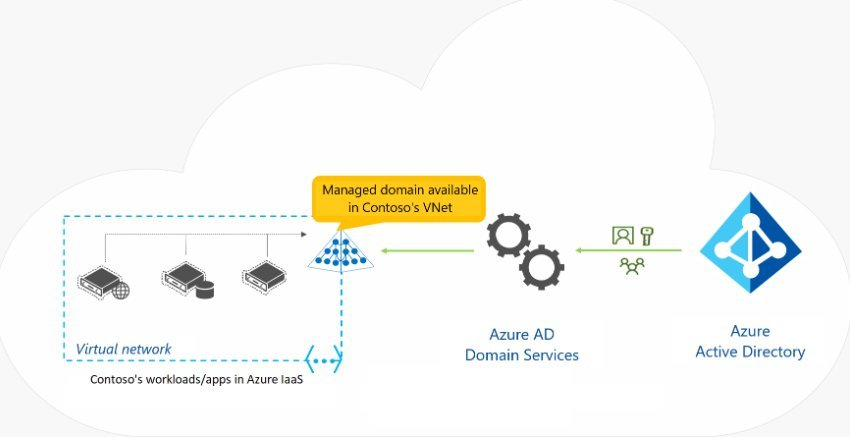 _(dimensioni: 850×437 px)_

*Figura 2 — Microsoft Entra Domain Services fornisce un dominio gestito nella VNet di Azure, sincronizzato da Microsoft Entra ID.* _(caption)_

**Vantaggi principali** _(stepTitle)_

- Gli amministratori non devono gestire, aggiornare o monitorare i domain controller.
- Non è necessario distribuire e gestire la replica di Active Directory.
- Non servono i gruppi Domain Admins o Enterprise Admins per i domini gestiti.

**Limitazioni da tenere in considerazione** _(stepTitle)_

- È supportato solo l'oggetto Active Directory Computer di base — lo schema non è estendibile.
- La struttura delle OU è flat: le unità organizzative nidificate non sono supportate.
- Esiste un solo GPO predefinito per account utente e computer; non è possibile usare filtri WMI o filtri per gruppi di sicurezza.
- Non è possibile fare riferimento a OU con GPO personalizzati.

---

## 2.2 — Creare, configurare e gestire identità
_(h2: Calibri 14pt grassetto #0078D4 keepNext)_

### 2.2.1 — Introduzione
_(h3: Calibri 12pt grassetto #2D5F8A keepNext)_

Una volta compreso che cos'è Microsoft Entra ID, il passo successivo è popolarlo e governarlo: creare gli utenti, organizzarli in gruppi, gestire dispositivi e licenze e automatizzare l'assegnazione degli accessi. Un'identità ben strutturata è ciò che permette di concedere a ciascuno il minimo accesso necessario per svolgere il proprio lavoro (principio del privilegio minimo).

In questa sezione imparerai a creare e gestire utenti e gruppi, a configurare la registrazione dei dispositivi, a gestire le licenze, a definire attributi di sicurezza personalizzati e a sfruttare la creazione automatica degli utenti.

### 2.2.2 — Creare, configurare e gestire utenti
_(h3: Calibri 12pt grassetto #2D5F8A keepNext)_

Ogni utente che deve accedere alle risorse Azure necessita di un account in Microsoft Entra ID. L'account contiene tutte le informazioni per autenticare l'utente durante il login. Dopo l'autenticazione, Entra ID compila un token di accesso che autorizza l'utente e determina a quali risorse può accedere.

**Tipi di identità utente** _(stepTitle)_

- **Identità cloud** — esistono solo in Microsoft Entra ID, senza alcuna controparte on-premise. Se l'account viene eliminato dalla directory principale viene rimosso definitivamente. L'origine nel portale è `Microsoft Entra ID` oppure `External Microsoft Entra Directory`.
- **Identità sincronizzate con directory** — esistono in un'Active Directory on-premise e vengono resi disponibili in Entra ID tramite sincronizzazione. Riconoscibili perché la loro origine nel portale è `Windows Server AD`. Strumento raccomandato: Microsoft Entra Cloud Sync; Microsoft Entra Connect Sync rimane disponibile per scenari complessi.
- **Utenti guest** — identità esterne all'organizzazione, invitate tramite Microsoft Entra B2B. L'origine nel portale è `Utente invitato`. Utili per fornitori, terzisti o partner. Quando la collaborazione termina, l'account guest può essere rimosso senza impattare l'identità originale dell'utente nel suo tenant.

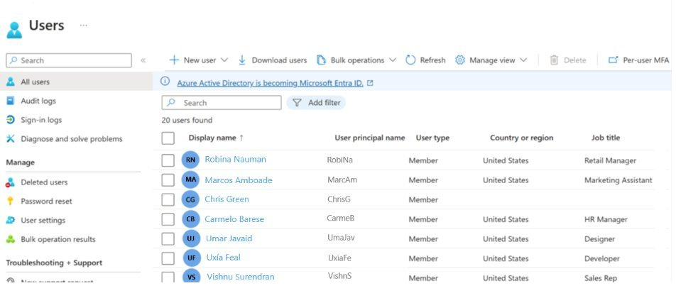 _(dimensioni: 946×398 px)_

*Figura 3 — Visualizzazione degli utenti nel portale Microsoft Entra ID con tipo utente, UPN, paese e ruolo.* _(caption)_

**Gestione degli account** _(stepTitle)_

- UPN (User Principal Name) — identificatore univoco nel formato `utente@dominio.com`, usato per il login.
- Gli account possono essere creati singolarmente dal portale, in blocco tramite CSV, o tramite PowerShell/CLI.
- Un utente eliminato rimane nel cestino per 30 giorni ed è ripristinabile; dopo 30 giorni viene eliminato definitivamente.
- A ogni utente si assegnano licenze Microsoft 365 / Entra ID direttamente o tramite appartenenza a gruppi.

### 2.2.3 — Creare, configurare e gestire gruppi
_(h3: Calibri 12pt grassetto #2D5F8A keepNext)_

I gruppi in Entra ID permettono di gestire l'accesso a risorse e applicazioni in modo centralizzato. Esistono due tipi principali:

- **Gruppi di sicurezza** — usati per controllare l'accesso a risorse Azure, applicazioni e licenze.
- **Gruppi Microsoft 365** — includono anche mailbox condivisa, calendario e sito SharePoint; usati per la collaborazione.

I gruppi possono avere tre modalità di appartenenza:

- **Assegnata** — i membri vengono aggiunti manualmente da un amministratore.
- **Dinamica utente** — i membri vengono aggiunti automaticamente in base a regole sulle proprietà utente (es. reparto, ruolo, paese). Richiede licenza Entra ID P1 o P2.
- **Dinamica dispositivo** — come la dinamica utente ma basata su proprietà dei dispositivi.

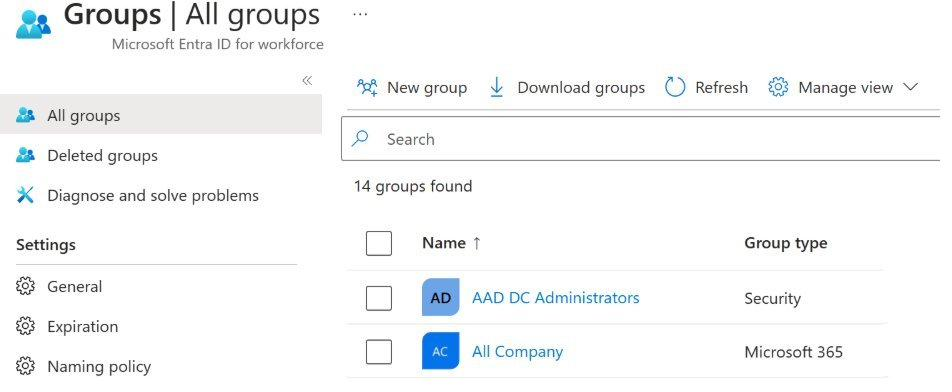 _(dimensioni: 940×378 px)_

*Figura 4 — Visualizzazione dei gruppi nel portale Microsoft Entra ID con tipo gruppo (Security e Microsoft 365).* _(caption)_

### 2.2.4 — Configurare e gestire la registrazione dei dispositivi
_(h3: Calibri 12pt grassetto #2D5F8A keepNext)_

Con la proliferazione dei dispositivi personali (BYOD) i team IT devono bilanciare due obiettivi opposti: consentire agli utenti di lavorare da qualsiasi dispositivo, proteggendo allo stesso tempo le risorse aziendali. Esistono tre modalità di registrazione:

**1. Registrazione in Microsoft Entra ID (Workplace Join — BYOD)** _(stepTitle)_

- Destinatari: utenti con dispositivi personali (smartphone, tablet, PC di casa).
- Il dispositivo non richiede un account aziendale per il login locale.
- Sistemi operativi supportati: Windows 10+, macOS 10.15+, iOS 15+, Android, Linux (Ubuntu, RHEL).
- Gestione tramite Microsoft Intune (MDM) o criteri di protezione delle app (MAM).
- Scenario tipico: un dipendente aggiunge l'account aziendale nelle impostazioni di Windows per leggere la posta dal PC di casa.

**2. Aggiunta a Microsoft Entra ID (Entra Join — cloud-only)** _(stepTitle)_

- Destinatari: organizzazioni cloud-first o cloud-only, senza infrastruttura AD DS on-premise.
- Il dispositivo richiede un account aziendale per il login — è un dispositivo di proprietà dell'organizzazione.
- Sistemi operativi supportati: Windows 10/11 (escluse edizioni Home), Windows Server 2019+ su Azure VM, macOS 13+ (anteprima).
- Gestione tramite Microsoft Intune o Configuration Manager in co-gestione.
- Scenario tipico: lavoratori stagionali, collaboratori esterni, filiali remote senza infrastruttura locale.

**3. Aggiunta ibrida a Microsoft Entra ID (Hybrid Join)** _(stepTitle)_

- Destinatari: organizzazioni con Active Directory on-premise esistente che vogliono estendere le identità al cloud.
- Il dispositivo è membro del dominio AD DS locale ed è anche registrato in Entra ID — SSO sia per risorse cloud che on-premise.
- Sistemi operativi supportati: Windows 10/11 (escluse edizioni Home), Windows Server 2016/2019/2022.
- Scenario tipico: aziende con app Win32 legacy che dipendono dall'autenticazione AD.

**Cloud Kerberos Trust** _(stepTitle)_

Il writeback dei dispositivi (Device Writeback) non è più supportato ed è stato sostituito da Cloud Kerberos Trust. Questo approccio consente ai dispositivi Entra Join e Hybrid Join di autenticarsi alle risorse on-premise senza dover scrivere oggetti dispositivo in Active Directory locale — abilitando Windows Hello for Business senza infrastruttura aggiuntiva.

### 2.2.5 — Gestire le licenze
_(h3: Calibri 12pt grassetto #2D5F8A keepNext)_

Le licenze Microsoft si assegnano a ogni utente che deve accedere ai servizi a pagamento. La gestione avviene tramite l'interfaccia di amministrazione di Microsoft 365 o tramite PowerShell e Microsoft Graph API.

**Assegnazione diretta vs basata su gruppo** _(stepTitle)_

- **Assegnazione diretta** — la licenza viene assegnata singolarmente a ogni utente. Semplice ma difficile da scalare.
- **Assegnazione basata su gruppo** — la licenza viene assegnata a un gruppo; tutti i membri ricevono automaticamente la licenza. Quando un utente entra nel gruppo ottiene la licenza; quando viene rimosso la perde. Le modifiche sono valide entro pochi minuti.

**Requisiti per le licenze basate su gruppo** _(stepTitle)_

Per usare la funzionalità di distribuzione automatica delle licenze tramite gruppo, il tenant deve avere almeno una sottoscrizione Entra ID P1 attiva. In pratica, le aziende medio-grandi sono operativamente obbligate ad avere P1: gestire manualmente le licenze per centinaia o migliaia di dipendenti sarebbe impossibile senza errori.

Le grandi aziende raramente acquistano P1 separatamente, perché è già incluso nei bundle Microsoft 365:

- Microsoft 365 E3 → include Entra ID P1
- Microsoft 365 E5 → include Entra ID P2

**Funzionalità avanzate** _(stepTitle)_

- **Disabilitare piani di servizio specifici** — quando si assegna una licenza a un gruppo è possibile disabilitare singoli servizi del prodotto (es. disabilitare Viva Engage su Microsoft 365).
- **Licenze da più origini** — un utente può essere membro di più gruppi con licenza e avere anche licenze assegnate direttamente. Se riceve la stessa licenza da più origini, essa viene contata e usata una volta sola.
- **Errori di assegnazione** — se le licenze disponibili sono insufficienti, Entra ID segnala gli utenti per cui l'assegnazione non è riuscita.

**Posizione di utilizzo** _(stepTitle)_

Alcuni servizi Microsoft non sono disponibili in tutte le aree geografiche. Prima di assegnare una licenza a un utente occorre impostare la posizione di utilizzo nel profilo utente. Per le licenze basate su gruppo, gli utenti senza posizione specificata ereditano la posizione della directory.

### 2.2.6 — Creare attributi di sicurezza personalizzati
_(h3: Calibri 12pt grassetto #2D5F8A keepNext)_

Gli attributi di sicurezza personalizzati (Custom Security Attributes) sono coppie chiave-valore definite dall'amministratore e specifiche per il tenant, che possono essere aggiunte a utenti, gruppi, applicazioni e service principal.

**Perché usarli — casi d'uso concreti** _(stepTitle)_

- Estendere il profilo utente con informazioni aziendali sensibili (es. stipendio orario, visibile solo agli amministratori HR).
- Categorizzare migliaia di applicazioni registrate nel tenant per creare un inventario filtrabile.
- Controllare l'accesso a risorse Azure specifiche tramite ABAC (Attribute-Based Access Control).
- Applicare governance degli attributi: definire chi può leggere e chi può scrivere ciascun attributo.

**Caratteristiche principali** _(stepTitle)_

- Disponibili a livello di tenant — una volta definiti sono accessibili in tutta la directory.
- Tipi di dati supportati: booleano, intero, stringa.
- Supportano valori singoli o multipli sullo stesso attributo.
- Supportano valori in formato libero o valori predefiniti (lista chiusa).
- Funzionano anche su utenti sincronizzati da Active Directory on-premise.
- Differiscono dalle estensioni di directory: sono progettati specificamente per scenari di sicurezza e controllo degli accessi, con governance integrata.

**Limitazioni importanti** _(stepTitle)_

- Non sono supportati in Microsoft Entra Domain Services.
- Non sono inclusi nelle attestazioni dei token SAML o nei JSON Web Token (JWT) — non possono essere usati direttamente nelle applicazioni che leggono i token per decidere i permessi.

### 2.2.7 — Esplorare la creazione automatica degli utenti
_(h3: Calibri 12pt grassetto #2D5F8A keepNext)_

Il provisioning automatico degli utenti (SCIM Provisioning) permette di creare, aggiornare e disabilitare automaticamente gli account in applicazioni SaaS (Salesforce, ServiceNow, Workday, ecc.) in base agli account presenti in Entra ID, senza intervento manuale. La chiave è mantenere sempre aggiornati i sistemi di gestione delle identità: se un utente viene rimosso dal sistema HR, viene deprovisionato automaticamente da Entra ID, riducendo il rischio di account orfani.

**Perché usare SCIM** _(stepTitle)_

- Usa il protocollo standard aperto SCIM 2.0 (System for Cross-domain Identity Management).
- Il provisioning può essere configurato anche in direzione inversa (inbound): Workday o SuccessFactors creano automaticamente gli utenti in Entra ID.
- Il ciclo di provisioning iniziale sincronizza tutti gli utenti; i cicli incrementali successivi gestiscono solo le modifiche.
- I log di provisioning nel portale Azure mostrano ogni operazione eseguita, utile per il troubleshooting.

**Provisioning in ingresso basato su API** _(stepTitle)_

Non tutti i sistemi HR espongono un endpoint SCIM nativo. Da marzo 2024 Microsoft Entra ID supporta il provisioning in ingresso basato su API: qualsiasi strumento di automazione o script può recuperare i dati della forza lavoro da qualsiasi sistema di record e inviarli direttamente all'API di provisioning di Entra ID. Le origini supportate includono Workday, SAP SuccessFactors e qualsiasi sistema HR personalizzato.

---

## 2.3 — Descrivere i componenti architetturali principali di Azure
_(h2: Calibri 14pt grassetto #0078D4 keepNext)_

I componenti principali dell'architettura di Azure si suddividono in due raggruppamenti fondamentali: l'**infrastruttura fisica** (data center, aree, zone di disponibilità, coppie di aree) e l'**infrastruttura di gestione** (risorse, gruppi di risorse, sottoscrizioni, gruppi di gestione). Comprendere questa gerarchia è fondamentale per progettare architetture resilienti, scalabili e conformi agli standard organizzativi.

### 2.3.1 — Introduzione
_(h3: Calibri 12pt grassetto #2D5F8A keepNext)_

In questo modulo vengono presentati i componenti principali dell'architettura di Azure: il layout fisico globale e la struttura di gestione logica. Insieme definiscono come Azure organizza, distribuisce e governa i servizi cloud su scala mondiale.

**Obiettivi di apprendimento** _(stepTitle)_

Al termine di questa sezione sarà possibile:

- Descrivere le aree di Azure, le coppie di aree e le aree sovrane.
- Descrivere le zone di disponibilità e le tre categorie di servizi che le supportano.
- Descrivere i data center di Azure e come vengono raggruppati in aree e zone.
- Descrivere le risorse Azure e i gruppi di risorse.
- Descrivere le sottoscrizioni e i loro due confini principali (fatturazione e controllo accessi).
- Descrivere i gruppi di gestione e la gerarchia completa di governance.
- Descrivere la relazione tra gruppi di risorse, sottoscrizioni e gruppi di gestione.

### 2.3.2 — Introduzione agli account Azure
_(h3: Calibri 12pt grassetto #2D5F8A keepNext)_

Per creare e usare i servizi Azure è necessaria una **sottoscrizione di Azure**. Quando si crea un account Azure viene generata automaticamente una sottoscrizione. È possibile creare sottoscrizioni aggiuntive in seguito — ad esempio sottoscrizioni separate per sviluppo, test e produzione. Dopo aver creato una sottoscrizione, è possibile iniziare a creare le risorse all'interno di ogni sottoscrizione.

**Gerarchia degli ambiti di un account Azure** _(stepTitle)_

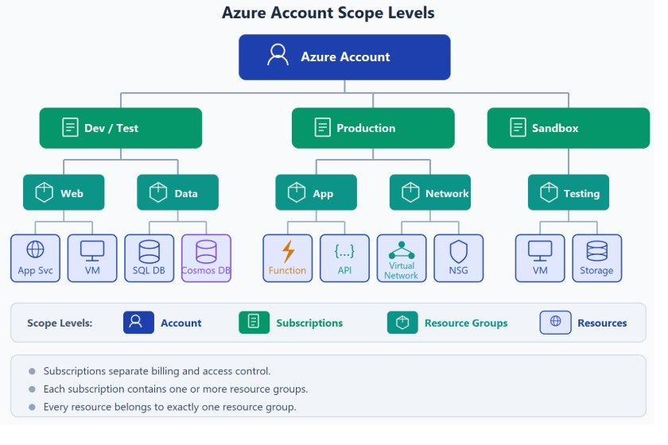 _(dimensioni: 460×298 px)_

*Figura 13 — Quattro livelli di ambito di un account Azure: un account si connette a più sottoscrizioni (Sviluppo/Test, Produzione, Sandbox), ognuna contenente gruppi di risorse (Web, Dati, App, Rete) che a loro volta contengono le singole risorse come Servizio app, VM, SQL DB, Cosmos DB, Funzioni, API, VNet e NSG.* _(caption)_

La struttura gerarchica di un account Azure è:

1. **Account Azure** — identità in Microsoft Entra ID a cui appartengono le sottoscrizioni.
2. **Sottoscrizioni** — unità di fatturazione e controllo degli accessi; ogni account può averne più.
3. **Gruppi di risorse** — contenitori logici che organizzano le risorse di una sottoscrizione.
4. **Risorse** — i singoli servizi creati (VM, database, reti virtuali, ecc.).

**Come acquistare l'accesso ad Azure** _(stepTitle)_

Esistono tre modalità per acquistare l'accesso ad Azure:

- **Direttamente da Microsoft** — iscrivendosi nel sito Web di Azure.
- **Tramite un rappresentante Microsoft** — per accordi enterprise e volumi elevati.
- **Tramite un partner Cloud Solution Provider (CSP)** — i partner CSP offrono soluzioni cloud gestite complete, compreso il supporto e la fatturazione centralizzata.

**Account gratuito Azure** _(stepTitle)_

L'account gratuito Azure è il punto di partenza ideale per esplorare la piattaforma senza costi iniziali:

- Accesso gratuito ai prodotti Azure più diffusi per **12 mesi**.
- **Credito** da usare nei primi 30 giorni su qualsiasi servizio.
- Accesso a più di **65 servizi sempre gratuiti** (senza scadenza).
- Richiede: numero di telefono, carta di credito (solo per verifica identità, non viene addebitata) e un account Microsoft o GitHub.

> **Monitorare l'utilizzo**: Se si esercitano le competenze creando risorse, è fondamentale monitorare l'utilizzo e rimuovere le risorse non più necessarie per evitare costi imprevisti al termine del periodo gratuito.
_(infoBox)_

**Account gratuito Azure per studenti** _(stepTitle)_

L'offerta per studenti è pensata per chi studia senza dover fornire una carta di credito:

- **100 $ di credito** da usare nei primi 12 mesi.
- Accesso gratuito a determinati servizi Azure e strumenti di sviluppo software per 12 mesi.
- Non richiede carta di credito per la registrazione — basta verificare lo status studentesco.

**Sandbox di Microsoft Learn** _(stepTitle)_

Per chi segue i percorsi di formazione su Microsoft Learn, la sandbox Learn è un ambiente Azure temporaneo e gratuito attivato direttamente dai moduli interattivi. Permette di eseguire esercizi pratici senza creare un account proprio, senza costi e senza rischi di spesa accidentale.

### 2.3.3 — Descrivere l'infrastruttura fisica di Azure
_(h3: Calibri 12pt grassetto #2D5F8A keepNext)_

L'infrastruttura fisica di Azure parte dai **data center** e si organizza gerarchicamente in aree e zone di disponibilità per garantire resilienza e affidabilità globale. Non si interagisce mai direttamente con i singoli data center: sono sempre raggruppati in strutture di livello superiore che offrono ridondanza automatica.

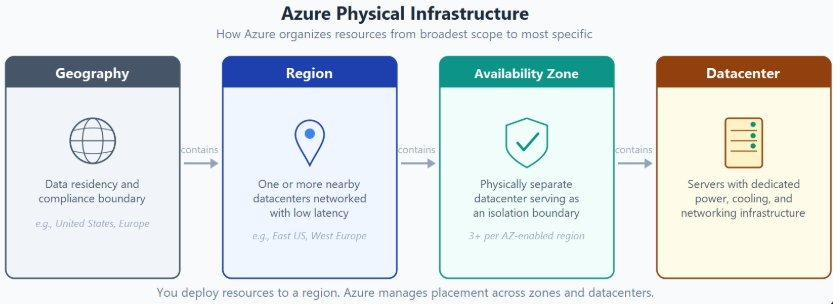 _(dimensioni: 580×212 px)_

*Figura 14 — Gerarchia dell'infrastruttura fisica di Azure dall'area geografica (Geography) all'area (Region) alla zona di disponibilità (Availability Zone) al data center.* _(caption)_

**Data Center** _(stepTitle)_

I data center Azure sono strutture fisiche con server disposti in rack, dotate di infrastruttura dedicata di alimentazione, raffreddamento e rete — simili a un data center aziendale on-premise, ma su scala globale. In qualità di provider di servizi cloud globale, Azure ha data center in tutto il mondo. Il sito Infrastruttura globale di Azure (https://infrastructuremap.microsoft.com/) offre la possibilità di esplorare interattivamente la distribuzione geografica dei data center.

**Aree (Regions)** _(stepTitle)_

Un'area è una zona geografica del mondo che contiene almeno uno, ma tipicamente più data center in stretta vicinanza, collegati tramite rete a bassa latenza. Azure assegna e controlla in modo intelligente le risorse in ogni area per garantire il bilanciamento dei carichi di lavoro.

Quando si distribuisce una risorsa in Azure è quasi sempre necessario scegliere l'area di destinazione. Alcuni servizi globali non richiedono la selezione di un'area specifica — ad esempio Microsoft Entra ID, Gestione traffico di Azure e DNS di Azure.

> **Disponibilità regionale**: Alcuni tipi di VM o funzionalità di archiviazione sono disponibili solo in determinate aree. Prima di progettare un'architettura, verificare sempre la disponibilità dei servizi richiesti nell'area target.
_(infoBox)_

**Zone di disponibilità (Availability Zones)** _(stepTitle)_

Le zone di disponibilità sono data center fisicamente separati all'interno della stessa area di Azure. Ogni zona è composta da uno o più data center con impianti indipendenti di alimentazione, raffreddamento e rete — configurati come limite di isolamento. Se una zona diventa inattiva, le altre continuano a funzionare. Le zone sono connesse tramite reti in fibra ottica private ad alta velocità.

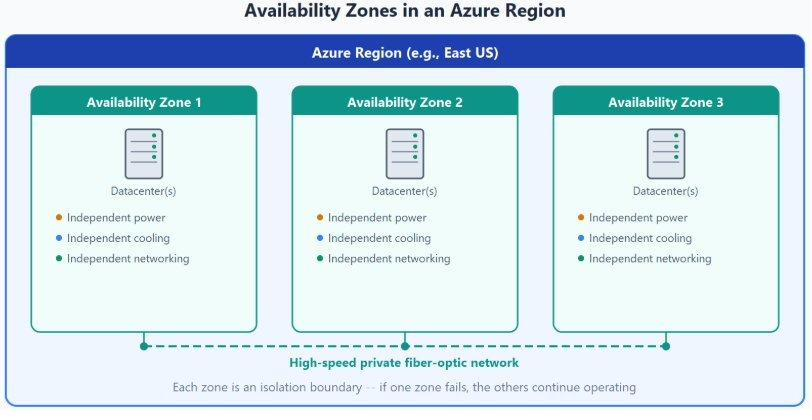 _(dimensioni: 460×233 px)_

*Figura 15 — Tre zone di disponibilità fisicamente separate all'interno di un'area di Azure, ciascuna con alimentazione, raffreddamento e rete indipendenti, connesse tra loro tramite collegamenti in fibra ottica.* _(caption)_

> **Requisito minimo**: Per garantire la resilienza, nelle aree abilitate per le zone di disponibilità sono sempre presenti almeno tre zone separate. Non tutte le aree di Azure supportano le zone di disponibilità.
_(infoBox)_

**Usare le zone di disponibilità per i carichi di lavoro** _(stepTitle)_

Quando si gestisce un'infrastruttura on-premise, la ridondanza implica l'acquisto e la gestione di hardware duplicato. Con Azure è possibile proteggere i carichi di lavoro distribuendoli tra zone di disponibilità all'interno di un'area. VM, archiviazione, database e altre risorse vengono posizionate in una zona e replicate in altre zone della stessa area. Tenere presente che potrebbe esserci un costo aggiuntivo per duplicare i servizi e trasferire dati tra zone.

**Tre categorie di servizi Azure rispetto alle zone di disponibilità** _(stepTitle)_

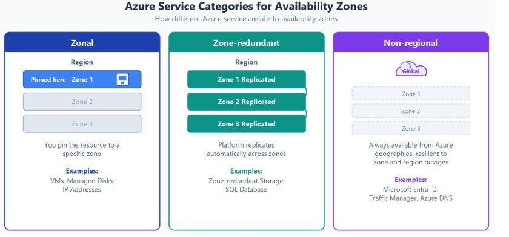 _(dimensioni: 460×219 px)_

*Figura 16 — Le tre categorie di servizi delle zone di disponibilità di Azure: Zonale (Zonal), A ridondanza di zona (Zone-redundant) e Non a livello di area (Non-regional).* _(caption)_

- **Servizi di zona (Zonal)** — la risorsa viene associata a una zona specifica scelta dal cliente, che gestisce anche la replica tra zone. Esempi: macchine virtuali, dischi gestiti, indirizzi IP.
- **Servizi a ridondanza di zona (Zone-redundant)** — la piattaforma replica automaticamente i dati e le operazioni tra le zone, senza intervento del cliente. Esempi: archiviazione con ridondanza di zona (ZRS), Azure SQL Database.
- **Servizi non a livello di area (Non-regional)** — sempre disponibili nelle aree geografiche di Azure, resilienti sia alle interruzioni a livello di zona sia a quelle a livello di area. Esempi: Microsoft Entra ID, Gestione traffico Azure, DNS di Azure.

**Coppie di aree (Region Pairs)** _(stepTitle)_

La maggior parte delle aree Azure è abbinata a un'altra area nella stessa collocazione geografica (es. USA, Europa, Asia) ad almeno **480 km di distanza**. Questo approccio consente la replica delle risorse tra due aree geografiche distinte, riducendo il rischio di interruzioni causate da calamità naturali, agitazioni sociali, interruzioni di corrente o guasti di rete su larga scala.

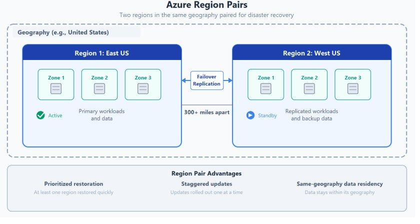 _(dimensioni: 460×241 px)_

*Figura 17 — Due aree di Azure abbinate all'interno della stessa area geografica, con replica di failover bidirezionale e vantaggi di continuità operativa.* _(caption)_

Esempi di coppie: **Stati Uniti occidentali ↔ Stati Uniti orientali**, **Asia sud-orientale ↔ Asia orientale**, **Europa occidentale ↔ Europa settentrionale**.

Vantaggi aggiuntivi delle coppie di aree:

- In caso di un'interruzione Azure di vaste proporzioni, viene assegnata priorità a un'area di ogni coppia per assicurarsi che almeno una venga ripristinata il più rapidamente possibile per le applicazioni ospitate.
- Gli aggiornamenti pianificati di Azure vengono implementati nelle coppie un'area alla volta, riducendo al minimo i tempi di inattività e il rischio di interruzione delle applicazioni.
- I dati continuano a risiedere nella stessa area geografica della coppia per scopi di residenza e conformità (eccezione: Brasile meridionale, abbinato a Stati Uniti centro-meridionali, fuori dalla propria area geografica).

> **Replica non automatica**: Non tutti i servizi Azure replicano automaticamente i dati o eseguono il failback dall'area problematica verso quella abbinata. In questi scenari il ripristino e la replica devono essere configurati esplicitamente dal cliente.
_(infoBox)_

> **Coppie bidirezionali e unidirezionali**: La maggior parte delle aree è abbinata bidirezionalmente (es. Stati Uniti occidentali e orientali si supportano a vicenda). Alcune aree come il Brasile meridionale sono abbinate in una sola direzione: l'area primaria non è il backup della sua secondaria. Alcune aree più recenti (Italia settentrionale, Polonia centrale, Israele centrale) non hanno coppie tradizionali e si basano sulle zone di disponibilità e sull'archiviazione con ridondanza geografica per la resilienza.
_(infoBox)_

**Aree sovrane** _(stepTitle)_

Le aree sovrane sono istanze di Azure isolate dall'istanza principale per requisiti legali o di conformità. Non sono accessibili ai clienti generali:

- **Azure Government** (US DoD Central, US Gov Virginia, US Gov Arizona, ecc.) — istanze fisiche e logiche isolate per enti pubblici e partner statunitensi. I data center sono gestiti da cittadini statunitensi selezionati e includono certificazioni di conformità aggiuntive (FedRAMP, DoD IL2/IL4/IL5).
- **Azure China** (Cina orientale, Cina settentrionale, ecc.) — disponibili nel contesto di una partnership esclusiva tra Microsoft e 21Vianet; i data center non sono gestiti direttamente da Microsoft ma dalla società cinese 21Vianet.

### 2.3.4 — Che cos'è Microsoft Azure
_(h3: Calibri 12pt grassetto #2D5F8A keepNext)_

Azure è un set di servizi cloud in continua espansione che consente di soddisfare le sfide IT attuali e future. Offre la libertà di creare, gestire e distribuire applicazioni in una rete globale di grandi dimensioni usando gli strumenti e i framework preferiti.

**Cosa offre Azure** _(stepTitle)_

- **Innovazione illimitata** — creare app e soluzioni intelligenti con tecnologia, strumenti e servizi avanzati (AI generativa, IoT, Machine Learning). La piattaforma consente di portare le idee alla vita e migliorare le funzionalità del team con servizi leader del settore.
- **Unificazione senza problemi** — gestire in modo efficiente tutte le soluzioni di infrastruttura, dati, analisi e intelligenza artificiale in una piattaforma integrata, semplificando la gestione e riducendo la complessità operativa.
- **Innovazione sulla fiducia** — affidarsi alla tecnologia di un partner dedicato alla sicurezza, conformità e responsabilità, con investimenti costanti in cybersecurity e certificazioni globali.

**Le categorie di servizi di Azure** _(stepTitle)_

Azure offre centinaia di servizi raggruppati in dieci categorie principali:

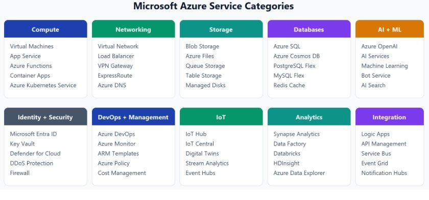 _(dimensioni: 460×204 px)_

*Figura 12 — Le dieci categorie di servizi di Azure: Calcolo, Rete, Archiviazione, Database, AI + ML, Identità + Sicurezza, DevOps + Gestione, IoT, Analisi e Integrazione.* _(caption)_

- **Calcolo** — macchine virtuali, container, funzioni serverless, servizi app.
- **Rete** — reti virtuali, bilanciamento del carico, CDN, gateway VPN.
- **Archiviazione** — Blob, File, Queue, Table, Disk storage.
- **Database** — Azure SQL, Cosmos DB, MySQL, PostgreSQL gestiti.
- **AI + Machine Learning** — Servizi di intelligenza artificiale di Azure, Azure OpenAI Service, Azure Machine Learning.
- **Identità + Sicurezza** — Microsoft Entra ID, Microsoft Defender for Cloud, Key Vault.
- **DevOps + Gestione** — Azure DevOps, Azure Monitor, Automation, Cost Management.
- **IoT** — Azure IoT Hub, IoT Central per la gestione di dispositivi connessi.
- **Analisi** — Azure Synapse Analytics, HDInsight, Stream Analytics.
- **Integrazione** — App Service Logic, Service Bus, Event Grid.

**Cosa è possibile fare con Azure** _(stepTitle)_

Azure offre centinaia di servizi che consentono di eseguire tutto: dall'esecuzione di applicazioni esistenti in VM all'esplorazione di nuovi paradigmi come bot intelligenti e AI generativa. Alcuni scenari concreti:

- Ospitare app web con scalabilità automatica in base al traffico, pagando solo per le risorse effettivamente consumate.
- Archiviare dati di qualsiasi tipo e dimensione con servizi di storage distribuiti e ridondanti.
- Aggiungere funzionalità di AI (riconoscimento vocale, visione, linguaggio naturale) a qualsiasi applicazione tramite Azure AI Services e Azure OpenAI Service.
- Gestire dispositivi IoT su scala globale raccogliendo e analizzando telemetria in tempo reale.

**Percorso di maturità cloud** _(stepTitle)_

Molte organizzazioni iniziano spostando le applicazioni esistenti in macchine virtuali (VM) su Azure — è un punto di partenza valido. Man mano che le competenze crescono, è possibile modernizzare i carichi di lavoro un passo alla volta:

- Da **server gestiti manualmente** a database gestiti e scalabili automaticamente.
- Da **app monolitiche** a microservizi con deployment indipendenti e scalabilità granulare.
- Da **carichi di lavoro statici** ad architetture event-driven e serverless che reagiscono alla domanda in tempo reale.

**Esempio pratico** _(stepTitle)_

Un'organizzazione con picchi di domanda stagionali può ospitare l'applicazione in servizi app gestiti, archiviare i dati in database gestiti e monitorare l'integrità da un dashboard centralizzato. Con l'aumentare della domanda è possibile aumentare le risorse; quando la domanda cala si ridimensiona, pagando solo per ciò che si usa effettivamente — nessun acquisto di hardware preventivo per gestire il picco annuale.

> **Portale Azure**: Il portale Azure (portal.azure.com) è l'interfaccia grafica web per creare, gestire e monitorare tutte le risorse cloud. È disponibile 24/7, aggiornato continuamente senza downtime programmati. Accessibile anche tramite Azure CLI, Azure PowerShell e REST API per scenari di automazione e integrazione.
_(infoBox)_

### 2.3.5 — Descrivere l'infrastruttura di gestione di Azure
_(h3: Calibri 12pt grassetto #2D5F8A keepNext)_

L'infrastruttura di gestione comprende le risorse, i gruppi di risorse, le sottoscrizioni e i gruppi di gestione. Comprendere questa gerarchia consente di organizzare le risorse, controllare chi può accedere a cosa e gestire i costi man mano che cresce l'utilizzo di Azure.

**Risorse e gruppi di risorse** _(stepTitle)_

Una **risorsa** è l'elemento costitutivo di base di Azure: tutto ciò che si crea, fornisce o distribuisce è una risorsa. Macchine virtuali, reti virtuali, database, account di archiviazione e servizi AI sono tutti esempi di risorse.

I **gruppi di risorse** sono contenitori logici che raggruppano risorse correlate per semplificarne la gestione. Regole fondamentali:

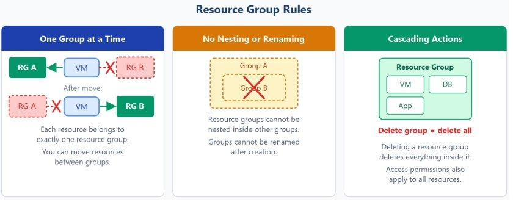 _(dimensioni: 460×180 px)_

*Figura 18 — Le tre regole del gruppo di risorse: una risorsa appartiene a un solo gruppo alla volta (con possibilità di spostamento), i gruppi non possono essere annidati né rinominati, e l'eliminazione di un gruppo elimina tutte le risorse al suo interno.* _(caption)_

- Ogni risorsa deve appartenere a **esattamente un** gruppo di risorse alla volta.
- È possibile spostare alcune risorse tra gruppi, ma una risorsa è associata a un solo gruppo in ogni momento.
- I gruppi di risorse **non possono essere annidati** e **non possono essere rinominati** dopo la creazione — scegliere una convenzione di denominazione chiara fin dall'inizio.
- Le azioni applicate a un gruppo si propagano a tutte le risorse al suo interno: eliminare il gruppo elimina tutti i contenuti; concedere o negare l'accesso si applica a tutto il contenuto.

Non esistono regole rigide per strutturare i gruppi di risorse — scegliere l'approccio più adatto alla propria situazione.

Esempi pratici di organizzazione in gruppi di risorse:

- **Ambiente temporaneo**: raggruppare tutte le risorse di un ambiente di sviluppo consente di eliminarlo intero in un'unica operazione al termine del progetto, senza dover individuare e cancellare le risorse una per una.
- **Più progetti in parallelo**: un gruppo separato per ogni progetto permette a ogni team di vedere e gestire solo le proprie risorse, con visibilità e governance isolate.

**Sottoscrizioni Azure** _(stepTitle)_

Le sottoscrizioni sono un'unità di **gestione, fatturazione e scalabilità** in Azure. Una sottoscrizione Azure è collegata a un account Azure (identità in Microsoft Entra ID) e funge da unità di fatturazione. Un account può avere più sottoscrizioni, ma ne è necessaria almeno una.

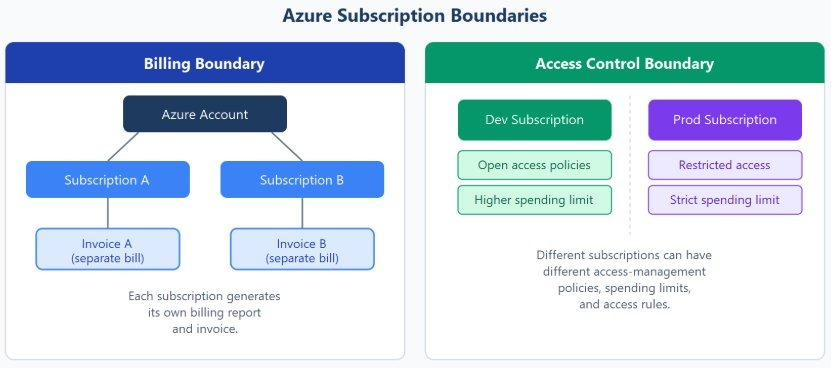 _(dimensioni: 460×204 px)_

*Figura 20 — I due tipi di confini di sottoscrizione: limite di fatturazione (ogni sottoscrizione genera fattura separata) e limite di controllo degli accessi (criteri di accesso e limiti di spesa diversi per sviluppo e produzione).* _(caption)_

Ogni sottoscrizione ha due confini principali:

- **Limite di fatturazione** — ogni sottoscrizione genera report di fatturazione e fatture separati. Azure genera report separati per ogni sottoscrizione, utile per separare i costi per reparto, progetto o cliente.
- **Limite di controllo degli accessi** — Azure applica i criteri di gestione degli accessi a livello di sottoscrizione. È possibile creare una sottoscrizione per lo sviluppo e una per la produzione, ognuna con limiti di spesa e regole di accesso completamente distinti.

Le ragioni più comuni per creare sottoscrizioni aggiuntive sono:

- **Ambienti** — sottoscrizioni separate per sandbox, sviluppo, test e produzione. Il controllo degli accessi si applica a livello di sottoscrizione, rendendola un confine naturale e sicuro per isolare gli ambienti.
- **Separazione team/carichi di lavoro** — ogni progetto o team con la propria sottoscrizione semplifica il tracciamento dei costi e l'isolamento degli ambienti; è possibile separare i carichi di lavoro in sandbox isolate dall'ambiente di produzione.
- **Fatturazione granulare** — una sottoscrizione per i carichi di lavoro di produzione e una per sviluppo/test permette di monitorare e ottimizzare i costi separatamente con visibilità dedicata.

**Gruppi di gestione (Management Groups)** _(stepTitle)_

Per ambienti con molte sottoscrizioni distribuite su più team o aree geografiche è necessario un livello di governance superiore: i **gruppi di gestione**. I gruppi di gestione si trovano sopra le sottoscrizioni e consentono di applicare condizioni di governance (policy di accesso, regole di conformità) a un intero insieme di sottoscrizioni in una sola operazione. Tutte le sottoscrizioni in un gruppo di gestione ereditano automaticamente tali condizioni, esattamente come le risorse ereditano le impostazioni dal proprio gruppo di risorse.

Caratteristiche fondamentali dei gruppi di gestione:

- I gruppi di gestione possono essere **annidati fino a sei livelli** di profondità (esclusi il livello radice e il livello sottoscrizione).
- Ogni tenant Microsoft Entra ha un solo **gruppo radice del tenant** di primo livello; tutti gli altri gruppi e sottoscrizioni vi sono raggruppati sotto — questo consente di applicare i criteri di governance a livello globale.
- Una singola directory supporta fino a **10.000 gruppi di gestione**.
- Ogni gruppo di gestione e sottoscrizione può avere un **solo elemento padre**.

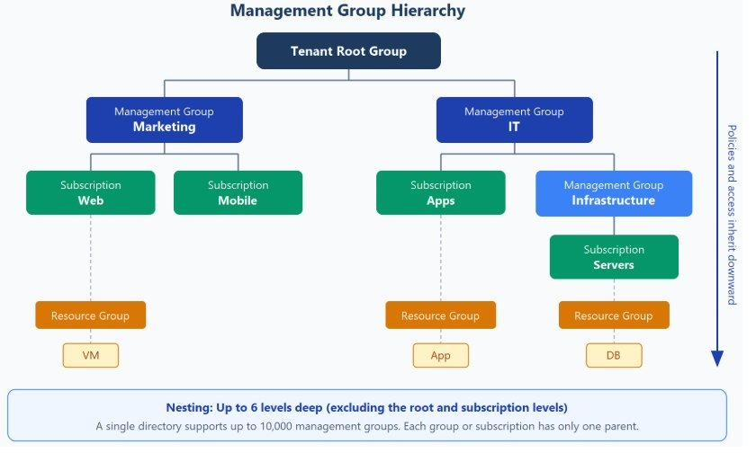 _(dimensioni: 460×277 px)_

*Figura 19 — Gerarchia di gruppi di gestione dal gruppo radice del tenant verso il basso tramite gruppi (Marketing, IT) a sottoscrizioni (Web, Mobile, App, Server), gruppi di risorse e singole risorse, con policy e accessi che ereditano verso il basso.* _(caption)_

Esempi di utilizzo dei gruppi di gestione:

- **Applicare una policy tra sottoscrizioni** — limitare le posizioni delle VM all'area West Europe in un gruppo chiamato "Produzione": il criterio viene ereditato da tutte le sottoscrizioni nel gruppo e si applica a tutte le VM. Il proprietario della risorsa o della sottoscrizione non può eseguirne l'override, rafforzando la governance centralizzata.
- **Concedere l'accesso a più sottoscrizioni contemporaneamente** — un'unica assegnazione Azure RBAC al livello del gruppo di gestione si propaga automaticamente a tutti i gruppi di sottogestione, sottoscrizioni, gruppi di risorse e risorse sottostanti, senza dover creare script di controllo degli accessi per ogni singola sottoscrizione.

**Gerarchia completa di gestione Azure** _(stepTitle)_

La gerarchia completa dall'alto verso il basso è:

    Tenant Root Group
    └── Gruppi di gestione (fino a 6 livelli annidati)
        └── Sottoscrizioni
            └── Gruppi di risorse
                └── Risorse

> **Ereditarietà a cascata**: Policy e assegnazioni RBAC applicate a un livello superiore si propagano automaticamente a tutti i livelli inferiori. Questo modello permette di applicare standard di governance a tutta l'organizzazione con un minimo di configurazione, mantenendo al contempo la flessibilità di applicare impostazioni specifiche a singoli livelli della gerarchia.
_(infoBox)_

---

## 2.4 — Iniziative di Criteri di Azure
_(h2: Calibri 14pt grassetto #0078D4 keepNext)_

### 2.4.1 — Introduzione
_(h3: Calibri 12pt grassetto #2D5F8A keepNext)_

Azure Policy è il servizio di governance di Azure che consente di creare, assegnare e gestire policy che applicano regole ed effetti sulle risorse Azure, garantendo che rimangano conformi agli standard IT aziendali e agli accordi sul livello di servizio. Le policy sono descritte in formato JSON e sono dette **definizioni di policy**.

Le **iniziative di Azure Policy** (dette anche policy set) sono raccolte di definizioni di policy raggruppate verso un obiettivo specifico o una finalità comune. Consolidando più policy in un unico elemento, le iniziative consentono un controllo centralizzato sull'intera infrastruttura Azure. Organizzazioni in settori regolamentati (governo, finanza, sanità) usano iniziative di policy per soddisfare rapidamente i requisiti normativi nazionali e regionali, creare guardrail cloud e applicare regolamenti specifici in modo efficace.

**Attività comuni gestite da Azure Policy** _(stepTitle)_

- Assegnare una policy per applicare una condizione sulle risorse create in futuro.
- Creare e assegnare una definizione di iniziativa per tracciare la conformità su più risorse.
- Risolvere una risorsa non conforme o bloccata.
- Implementare una nuova policy in tutta l'organizzazione in modo graduale e controllato.

> **Responsabilità di conformità**: Le organizzazioni sono interamente responsabili di garantire la propria conformità a leggi e regolamenti applicabili. Azure Policy è uno strumento tecnico di governance, non un sostituto della consulenza legale.
_(infoBox)_

### 2.4.2 — Cloud Adoption Framework for Azure
_(h3: Calibri 12pt grassetto #2D5F8A keepNext)_

Il **Cloud Adoption Framework (CAF)** è una guida Microsoft completa che aiuta architetti cloud, esperti IT e leader aziendali a raggiungere gli obiettivi di adozione del cloud. Include best practice, documentazione e strumenti contribuiti da dipendenti Microsoft, partner e clienti. Azure Policy è lo **strumento di governance primario** raccomandato dal CAF.

La cloud governance riguarda la gestione di tutti gli aspetti dell'uso del cloud all'interno dell'organizzazione: minimizza i rischi (conformità, sicurezza, gestione delle risorse, dati), ottimizza le operazioni e garantisce che le attività cloud siano coerenti con la strategia aziendale. Il **CAF Govern methodology** fornisce un framework sistematico per stabilire e migliorare la governance cloud.

 _(dimensioni: 2058×964 px)_

*Figura 21 — Le metodologie del Microsoft Cloud Adoption Framework for Azure per ogni fase del ciclo di vita di adozione del cloud: Strategy, Plan, Ready, Adopt, Govern e Manage.* _(caption)_

**I 5 step della cloud governance** _(stepTitle)_

La cloud governance è un processo continuo che richiede monitoraggio, valutazione e aggiustamenti costanti per adattarsi a tecnologie, rischi e requisiti di conformità in evoluzione.

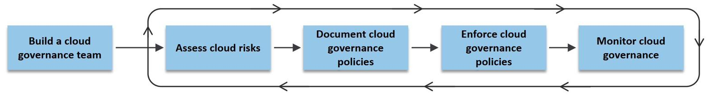 _(dimensioni: 2031×278 px)_

*Figura 22 — I 5 step della cloud governance: processo iterativo da Build a cloud governance team fino a Monitor cloud governance.* _(caption)_

1. **Costituire un team di governance** — un team dedicato responsabile di definire, mantenere e rendicontare le policy di governance cloud.
2. **Valutare i rischi cloud** — analisi approfondita dei rischi specifici dell'organizzazione: conformità normativa, sicurezza, operazioni, costi, gestione dei dati, risorse e AI.
3. **Documentare le policy di governance** — policy chiare che definiscono l'uso accettabile del cloud e le regole per mitigare i rischi identificati.
4. **Applicare le policy di governance** — implementazione sistematica tramite strumenti automatizzati e supervisione manuale. Strumenti come Azure Policy aiutano a impostare guardrail, monitorare configurazioni e garantire l'aderenza alle policy.
5. **Monitorare la governance cloud** — monitoraggio regolare dell'utilizzo del cloud e del team di governance per verificare la conformità continua alle policy stabilite.

> **Processo iterativo**: I passi 1-5 vanno completati per stabilire la governance iniziale. In seguito è necessario iterare regolarmente sui passi 2-5 per mantenere la governance nel tempo man mano che il cloud si evolve.
_(infoBox)_

**Le 3 considerazioni chiave per definire una policy** _(stepTitle)_

- **Rischio aziendale** — documentare i rischi in evoluzione e la tolleranza al rischio in base alla classificazione dei dati e alla criticità delle applicazioni.
- **Policy e conformità** — tradurre le decisioni sui rischi in dichiarazioni di policy per definire in modo efficiente i confini di adozione del cloud.
- **Processo** — stabilire processi per monitorare le violazioni e l'aderenza alle policy aziendali.

 _(dimensioni: 2220×1022 px)_

*Figura 23 — Le 3 considerazioni chiave per definire una policy di governance cloud: Business Risk, Policy and Compliance, Process.* _(caption)_

**Le 5 discipline fondamentali della cloud governance** _(stepTitle)_

- **Cost Management** — valutazione e monitoraggio dei costi, controllo delle spese IT e adeguamento delle risorse alla domanda per massimizzare il valore degli investimenti.
- **Security Baseline** — applicazione di una baseline di sicurezza a tutti gli sforzi di adozione cloud, garantendo la conformità ai requisiti di sicurezza IT.
- **Resource Consistency** — coerenza nella configurazione delle risorse e applicazione di pratiche per l'onboarding, il ripristino e la individuazione.
- **Identity Baseline** — applicazione coerente di definizioni e assegnazioni di ruoli per garantire la baseline di identità e accesso.
- **Deployment Acceleration** — accelerazione del deployment tramite centralizzazione, coerenza e standardizzazione dei template di distribuzione.

**Azure Policy come strumento di governance** _(stepTitle)_

Azure Policy facilita la governance di tutte le risorse — correnti e future — applicando standard organizzativi e valutando la conformità su larga scala. Vantaggi chiave:

- **Gestione centralizzata** — traccia lo stato di conformità e analizza le modifiche che portano alla non conformità in un unico repository.
- **Dashboard di conformità** — vista aggregata dello stato complessivo dell'ambiente, con possibilità di approfondire dettagli a livello di singola risorsa e singola policy.
- **Remediation automatica** — le nuove risorse vengono corrette automaticamente; le risorse esistenti tramite remediation task espliciti.
- **Integrazione con DevOps** — Azure Policy si integra con Azure DevOps applicando policy nelle pipeline CI/CD nelle fasi di pre-deployment e post-deployment.

**Esempi pratici di governance con Azure Policy** _(stepTitle)_

- Consentire il deployment di risorse Azure solo in aree geografiche approvate.
- Applicare regole di geo-replication per rispettare i requisiti di data residency.
- Limitare i tipi e le dimensioni di VM consentite nell'ambiente cloud.
- Imporre l'applicazione coerente di tag tassonomici su tutte le risorse.
- Raccomandare aggiornamenti di sistema sui server.
- Richiedere l'autenticazione a più fattori (MFA) per tutti gli account delle sottoscrizioni.
- Obbligare le risorse a inviare log di diagnostica a un workspace di Azure Monitor.

> **Bilanciamento controllo/velocità**: Una policy ben progettata bilancia controllo e stabilità con velocità operativa. Troppo controllo rallenta i team; troppa libertà genera rischi. È necessario valutare attentamente l'impatto prima di introdurre nuove policy restrittive su ambienti di produzione.
_(infoBox)_

### 2.4.3 — Principi di progettazione di Azure Policy
_(h3: Calibri 12pt grassetto #2D5F8A keepNext)_

Azure Policy segue un approccio dichiarativo: si definisce lo stato desiderato delle risorse e Azure si occupa di valutare e applicare le regole. Azure fornisce quattro livelli di gestione per una governance corretta: Management Groups, Subscriptions, Resource Groups e Resources. I livelli inferiori ereditano le impostazioni da quelli superiori.

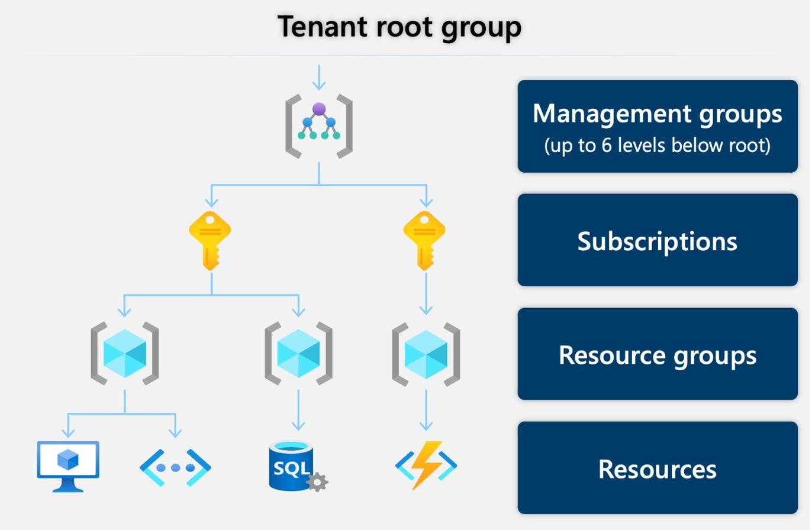 _(dimensioni: 500×327 px)_

*Figura 24 — Gerarchia di governance Azure: Tenant Root Group → Management Groups → Subscriptions → Resource Groups → Resources, con policy e accessi che ereditano verso il basso.* _(caption)_

**Azure Resource Manager e i due piani** _(stepTitle)_

Azure Resource Manager (ARM) è il servizio di deployment e gestione di Azure. Tutte le operazioni si dividono in due categorie:

- **Control plane** — gestisce le risorse nella sottoscrizione (creare, aggiornare, eliminare). Azure Policy opera qui, integrata con ARM, valutando ogni richiesta prima dell'esecuzione. Quando arriva una richiesta tramite portale, CLI, PowerShell o API, ARM autentica, verifica RBAC e poi valuta Azure Policy nell'ordine indicato. ARM gestisce anche funzioni essenziali come deployment basati su template, auditing, monitoring e tagging.
- **Data plane** — operazioni dirette sui dati all'interno di una risorsa già esistente (es. caricare file su uno storage account, leggere segreti da Key Vault, interrogare un database SQL). Queste operazioni bypassano ARM e vengono gestite direttamente dal resource provider del servizio tramite i propri endpoint dati.

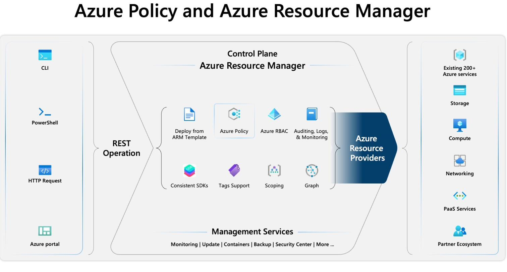 _(dimensioni: 500×260 px)_

*Figura 25 — Azure Policy e Azure Resource Manager: il Control Plane riceve le richieste da CLI, PowerShell, HTTP e portale Azure, le elabora tramite Azure Policy, RBAC, ARM Templates e altri servizi, e le instrada ai Resource Provider.* _(caption)_

> **RBAC prima di Azure Policy**: Quando una richiesta arriva ad ARM, viene valutato prima RBAC e poi Azure Policy. Se l'utente non ha i permessi RBAC necessari, Azure Policy non viene nemmeno considerata — la richiesta fallisce già al controllo dei permessi.
_(infoBox)_

**Modalità data plane di Azure Policy** _(stepTitle)_

Azure Policy permette ai singoli servizi Azure di implementare un'estensione che abilita il controllo delle policy anche sul data plane, attraverso specifici **Resource Provider Modes**:

- `Microsoft.Kubernetes.Data` — gestione di cluster Kubernetes e componenti (pod, container, ingress).
- `Microsoft.KeyVault.Data` — gestione di vault e certificati in Azure Key Vault.
- `Microsoft.Network.Data` — gestione delle policy di appartenenza personalizzate in Azure Virtual Network Manager.
- `Microsoft.ManagedHSM.Data` — gestione delle chiavi HSM gestite di Azure Key Vault (preview).
- `Microsoft.DataFactory.Data` — utilizzo di Azure Policy per negare nomi di dominio per il traffico in uscita di Azure Data Factory.
- `Microsoft.MachineLearningServices.v2.Data` — gestione delle distribuzioni di modelli Azure Machine Learning.

**Greenfield vs Brownfield** _(stepTitle)_

Azure Resource Manager gestisce due scenari distinti per l'applicazione delle policy:

 _(dimensioni: 1996×978 px)_

*Figura 26 — I due scenari di gestione delle richieste ARM: Greenfield (policy-first, risorsa creata dopo la policy) e Brownfield (resource-first, policy assegnata a risorse già esistenti).* _(caption)_

- **Greenfield (policy-first)** — la policy esiste già quando si crea o aggiorna una risorsa. La valutazione avviene in tempo reale: ARM riceve la richiesta, verifica RBAC, valuta Azure Policy e blocca immediatamente se la risorsa non è conforme. Per gli aggiornamenti, Azure Policy legge lo stato corrente della risorsa, lo fonde con il delta della modifica richiesta (target state), e valuta il risultato.
- **Brownfield (resource-first)** — le risorse esistono già quando viene assegnata una nuova policy. La valutazione avviene tramite compliance scan automatico ogni 24 ore o manuale tramite `az policy state trigger-scan`. Le risorse esistenti non conformi vengono segnalate ma non eliminate; i tentativi futuri di creare risorse non conformi vengono bloccati.

> **Esempio pratico**: Si crea una policy che vieta la creazione di risorse fuori dall'area West Europe. Le VM già esistenti in East US non vengono cancellate ma risultano non conformi nel report. Qualsiasi nuova VM creata in East US viene bloccata immediatamente.
_(infoBox)_

### 2.4.4 — Risorse di Azure Policy
_(h3: Calibri 12pt grassetto #2D5F8A keepNext)_

Azure Policy mette a disposizione 6 risorse principali: Definizioni, Iniziative, Assegnazioni, Esenzioni, Attestazioni e Remediation task.

 _(dimensioni: 2070×984 px)_

*Figura 27 — Le 6 risorse di Azure Policy e i concetti correlati: Definitions, Initiatives, Assignments, Exemptions, Attestations e Remediations.* _(caption)_

**Definizioni (Definitions)** _(stepTitle)_

La regola vera e propria, scritta in JSON. Descrive la condizione da valutare e l'effetto da applicare. La posizione in cui viene salvata la definizione (management group o sottoscrizione) determina l'ambito a cui l'iniziativa o la policy può essere assegnata. Possono essere di due tipi:

- **Built-in** — generate da Azure Resource Providers, disponibili per default. Azure ne offre centinaia pronte all'uso raggruppabili in **iniziative built-in** (es. framework ISO 27001, NIST, CIS, PCI-DSS).
- **Custom** — scritte dall'utente quando nessuna built-in copre il requisito specifico. Raggruppabili in **iniziative custom**. Microsoft for Sovereignty pubblica iniziative custom nel repository `industry-policy-portfolio` su GitHub.

**Iniziative (Initiatives / Policy Set)** _(stepTitle)_

Raccolta di più definizioni di policy raggruppate per un obiettivo comune (es. conformità a un framework normativo, standard di sicurezza baseline). Semplifica l'assegnazione di molte policy in una sola operazione: invece di assegnare ogni policy individualmente, si applica l'iniziativa alle risorse Azure. Anche le iniziative possono essere built-in o custom.

> **Built-in vs Custom**: Le iniziative built-in coprono i principali framework normativi (ISO 27001, NIST, CIS, FedRAMP). Le iniziative custom permettono di costruire un set di policy su misura per i requisiti specifici dell'organizzazione, con la possibilità di sovrapporre più iniziative per formare una soluzione completa.
_(infoBox)_

**Assegnazioni (Assignments)** _(stepTitle)_

Il collegamento tra una definizione/iniziativa e uno specifico ambito (management group, sottoscrizione o gruppo di risorse). Proprietà configurabili durante l'assegnazione:

- **Resource selectors** — rollout graduale basato sulla posizione o il tipo delle risorse.
- **Overrides** — modificare l'effetto di una policy senza cambiare la definizione originale.
- **enforcementMode** — impostare a `DoNotEnforce` per la modalità what-if: valuta la conformità senza applicare l'effetto (utile prima di abilitare una policy in produzione).
- **Excluded scopes** — escludere contenitori o risorse interni dall'ambito dell'assegnazione.
- **Noncompliance messages** — messaggi personalizzati mostrati quando una risorsa non è conforme.
- **Parameters** — assegnare valori ai parametri della definizione.
- **Managed identity** — richiesta per le policy con effetto `deployIfNotExists` o `modify` per abilitare le azioni di remediation (system-assigned o user-assigned).

**Esenzioni (Exemptions)** _(stepTitle)_

Permettono di escludere una risorsa o una gerarchia dalla valutazione di una policy, pur conteggiandola nel report di conformità generale. Si creano **dopo** l'assegnazione, non durante. Due categorie:

- **Mitigated** — l'obiettivo della policy è raggiunto tramite un metodo alternativo.
- **Waiver** — la non conformità è temporaneamente accettata (es. durante una migrazione in corso).

**Attestazioni (Attestations)** _(stepTitle)_

Usate per impostare manualmente lo stato di conformità su risorse o ambiti targetizzati da policy con effetto `manual` — ad esempio policy che verificano processi organizzativi non rilevabili automaticamente (audit di processo, verifiche di documentazione). Ogni risorsa applicabile richiede un'attestazione per ogni assegnazione di policy manuale.

**Remediation task** _(stepTitle)_

Attività di correzione per portare risorse non conformi a uno stato conforme. Applicabili solo alle definizioni con effetto `modify` o `deployIfNotExists`. Le risorse create o aggiornate **dopo** l'assegnazione vengono corrette automaticamente; quelle già esistenti richiedono un remediation task esplicito.

> **Ambito (Scope)**: L'ambito definisce dove viene applicata la policy. Una policy assegnata a un Management Group si applica a tutte le sottoscrizioni, gruppi di risorse e risorse sotto di esso. La scelta della posizione della definizione determina i livelli a cui può essere assegnata.
_(infoBox)_

### 2.4.5 — Definizioni di Azure Policy
_(h3: Calibri 12pt grassetto #2D5F8A keepNext)_

Una definizione di policy descrive le condizioni di conformità di una risorsa e l'effetto da applicare se la condizione è soddisfatta. Si compone di due parti: una condizione (`if`) e un effetto (`then`).

**Anatomia di una definizione JSON** _(stepTitle)_

| Elemento | Descrizione |
|----------|-------------|
| `displayName` (max 128 car.) | Nome identificativo della policy nel portale. |
| `description` (max 512 car.) | Contesto d'uso della definizione. |
| `policyType` (sola lettura) | Origine della definizione: `BuiltIn` (Microsoft), `Custom` (cliente), `Static` (Regulatory Compliance, di proprietà Microsoft). |
| `mode` | Target della policy. Modalità ARM: `All` (tutti i tipi di risorse) o `Indexed` (solo tipi che supportano tag e posizione). Modalità Resource Provider: specifiche per ogni servizio (es. `Microsoft.Kubernetes.Data`). |
| `version` (opzionale) | Le definizioni built-in possono avere più versioni con lo stesso ID. Se non specificata viene usata l'ultima versione. |
| `metadata` (max 1024 car.) | Informazioni aggiuntive: `version` (versione contenuti), `category` (categoria nel portale), `preview` (bool), `deprecated` (bool). |
| `parameters` (opzionale) | Valori configurabili che rendono la definizione riutilizzabile. Tipi: String, Array, Object, Boolean, Integer, Float, DateTime. |
| `policyRule` | La regola: blocco `if` (condizione) + blocco `then` (effetto). |

**Operatori logici nel blocco if** _(stepTitle)_

- `allOf` — equivalente all'AND logico: tutte le condizioni devono essere vere.
- `anyOf` — equivalente all'OR logico: almeno una condizione deve essere vera.
- `not` — inverte il risultato di una condizione. Può essere annidato in `allOf`/`anyOf` per scenari complessi.

**Tipi di condizioni** _(stepTitle)_

- **Fields** — valutano le proprietà della risorsa: `name`, `fullName`, `kind`, `type`, `location`, `id`, `identity.type`, `tags`, `tags['tagName']`, property aliases.
- **Value** — valutano un valore calcolato tramite funzioni ARM (es. `[resourceGroup().name]`).
- **Count** — contano quanti elementi di un array soddisfano un criterio; utilizzano la funzione `current()` per accedere al membro corrente dell'array.

I criteri di valutazione principali: `equals/notEquals`, `like/notLike`, `match/notMatch`, `contains/notContains`, `in/notIn`, `containsKey/notContainsKey`, `exists`, `greater/less/greaterOrEquals/lessOrEquals`.

**Funzioni di policy** _(stepTitle)_

Nelle policy rule sono disponibili le funzioni standard dei template ARM più alcune funzioni esclusive:

| Funzione | Descrizione |
|----------|-------------|
| `addDays(dateTime, n)` | Aggiunge `n` giorni a una data in formato ISO 8601. |
| `field(fieldName)` | Restituisce il valore del campo specificato dalla risorsa valutata nel blocco `if`. Principalmente usata con `auditIfNotExists` e `deployIfNotExists`. |
| `requestContext().apiVersion` | Restituisce la versione API della richiesta che ha scatenato la valutazione. |
| `policy()` | Restituisce informazioni sulla policy in valutazione: `assignmentId`, `definitionId`, `setDefinitionId`, `definitionReferenceId`. |
| `ipRangeContains(range, targetRange)` | Verifica se un range IP contiene un altro range IP; restituisce boolean. |
| `current(indexName)` | Funzione speciale usabile solo nelle espressioni `count`; restituisce il valore del membro dell'array in valutazione. |
| `utcNow()` | Restituisce la data/ora corrente in formato ISO 8601. Disponibile nelle policy rule (a differenza dei template ARM può essere usata ovunque, non solo in `defaultValue`). |

**Effetti disponibili (blocco then)** _(stepTitle)_

| Effetto | Tipo | Descrizione |
|---------|------|-------------|
| `Disabled` | Sincrono | Disattiva la policy senza rimuoverla. Verificato per primo. |
| `Append` | Sincrono | Aggiunge campi alla risorsa durante la creazione. In gran parte obsoleto, sostituito da `Modify`. |
| `Modify` | Sincrono | Aggiunge, aggiorna o rimuove proprietà e tag durante creazione o aggiornamento. |
| `Deny` | Sincrono | Blocca la richiesta se non conforme. |
| `DenyAction` | Sincrono | Blocca azioni specifiche su risorse esistenti (attualmente solo DELETE). |
| `Audit` | Asincrono | Crea un evento di avviso nel log attività senza bloccare la richiesta. |
| `AuditIfNotExists` | Asincrono | Segnala se una risorsa correlata (specificata nel blocco `then.details`) non esiste. |
| `DeployIfNotExists` | Asincrono | Esegue un template deployment automatico quando la condizione è soddisfatta e una risorsa correlata manca. |
| `Manual` | Attestazione manuale | Consente di attestare manualmente la conformità tramite attestazioni personalizzate. |

> **Effetti intercambiabili**: `audit`, `deny` e `modify/append` sono spesso intercambiabili. `auditIfNotExists` e `deployIfNotExists` sono spesso intercambiabili. `disabled` è intercambiabile con qualsiasi effetto. `manual` non è intercambiabile con nessun altro.
_(infoBox)_

**Cumulative most restrictive** _(stepTitle)_

Più policy possono essere assegnate alla stessa risorsa allo stesso o a diversi livelli di ambito. Ogni policy viene valutata in modo indipendente. Il risultato finale è il **cumulative most restrictive**: se una policy `Deny` e una policy `Audit` si applicano alla stessa risorsa, prevale il `Deny`.

La seguente definizione built-in limita le aree geografiche in cui è possibile distribuire risorse:

    {
      "displayName": "Allowed locations",
      "description": "Restrict the locations your organization can specify when deploying resources.",
      "policyType": "BuiltIn",
      "mode": "Indexed",
      "metadata": { "version": "1.0.0", "category": "General" },
      "parameters": {
        "listOfAllowedLocations": {
          "type": "Array",
          "metadata": { "strongType": "location", "displayName": "Allowed locations" }
        }
      },
      "policyRule": {
        "if": {
          "allOf": [
            { "field": "location", "notIn": "[parameters('listOfAllowedLocations')]" },
            { "field": "location", "notEquals": "global" },
            { "field": "type", "notEquals": "Microsoft.AzureActiveDirectory/b2cDirectories" }
          ]
        },
        "then": { "effect": "deny" }
      }
    }

> **Nota sul tipo b2cDirectories**: Il tipo `Microsoft.AzureActiveDirectory/b2cDirectories` viene escluso dalla logica perché il suo campo `location` non è un'area geografica standard (può essere "United States", "Europe", "Asia Pacific", "Australia") — richiederebbe una policy separata.
_(infoBox)_

### 2.4.6 — Valutazione delle risorse tramite Azure Policy
_(h3: Calibri 12pt grassetto #2D5F8A keepNext)_

**Trigger di valutazione** _(stepTitle)_

La valutazione delle policy assegnate avviene in risposta a diversi eventi:

- Una policy o iniziativa viene assegnata per la prima volta a un ambito.
- Una policy o iniziativa già assegnata viene aggiornata.
- Una risorsa viene creata o aggiornata nell'ambito tramite ARM, REST API o SDK.
- Una sottoscrizione viene creata o spostata in una gerarchia di Management Group con policy assegnate che targetizzano il tipo `Microsoft.Resources/subscriptions`.
- Una **policy exemption** viene creata, aggiornata o eliminata.
- Ciclo standard di valutazione della conformità (ogni 24 ore — **full scan automatico**).
- Scansione on-demand avviata manualmente: `az policy state trigger-scan`.
- Il resource provider di machine configuration aggiorna i dettagli di conformità di una risorsa gestita.

**Tempi e fattori che influenzano la scansione** _(stepTitle)_

Quando si assegna una nuova policy, può esserci un ritardo fino a **30 minuti** prima che entri in vigore, dovuto alla cache di ARM. Per bypassare il ritardo di cache è possibile effettuare logout e login per aggiornare la sessione ARM.

I fattori che influenzano la durata di una scansione di conformità:

- **Definizioni di policy** — dimensione e complessità delle definizioni aumentano il tempo di scansione.
- **Numero di policy** — più policy applicate, più lunga la scansione.
- **Dimensione dell'ambito** — ambiti più grandi richiedono più tempo.
- **Carico di sistema** — le scansioni di conformità sono operazioni a bassa priorità: se il sistema è occupato con operazioni interattive o ad alta priorità, la scansione viene posticipata, anche per ambienti piccoli.

**Stati di conformità delle risorse** _(stepTitle)_

Dopo la valutazione, Azure Policy assegna uno dei seguenti stati a ogni risorsa (ordinati per priorità in caso di stati multipli):

1. **Non-compliant** — la risorsa non rispetta una o più condizioni della policy.
2. **Compliant** — la risorsa rispetta tutte le condizioni della policy.
3. **Error** — errore nel template o nella valutazione della policy.
4. **Conflicting** — due o più policy hanno regole contraddittorie (es. due policy che aggiungono lo stesso tag con valori diversi).
5. **Protected** — la risorsa è coperta da un'assegnazione con effetto `denyAction`.
6. **Exempted** — la risorsa è esclusa dalla valutazione tramite un'esenzione.
7. **Unknown** — stato predefinito per le definizioni con effetto `manual`, in attesa di attestazione.

La percentuale di conformità si calcola dividendo le risorse `Compliant + Exempt + Unknown` per il totale delle risorse (che include tutti gli stati: Compliant, Non-compliant, Unknown, Exempt, Conflicting, Error).

**EnforcementMode — modalità What-If** _(stepTitle)_

L'`enforcementMode` è una proprietà dell'assegnazione che permette di disattivare l'applicazione dell'effetto mantenendo attiva la valutazione della conformità.

| Mode | Valore JSON | Remediation manuale | Entry Activity Log | Descrizione |
|------|-------------|---------------------|--------------------|-------------|
| Enabled | `Default` | Sì | Sì | L'effetto viene applicato durante creazione/aggiornamento. |
| Disabled | `DoNotEnforce` | Sì | No | L'effetto non viene applicato; la valutazione avviene comunque. |

Differenza fondamentale tra `disabled` e `DoNotEnforce`:
- Effetto `disabled` — impedisce la valutazione del tutto.
- `enforcementMode = DoNotEnforce` — permette la valutazione senza applicare l'effetto. I remediation task per `deployIfNotExists` possono essere avviati anche con `DoNotEnforce`.

**Safe deployment best practices** _(stepTitle)_

Applicare policy a un ambiente di produzione in esecuzione senza test adeguati può causare comportamenti indesiderati. Il framework di safe deployment per Azure Policy prevede due aspetti principali:

**Aspetto 1 — Iniziare con enforcementMode Disabled**

Assegnare la policy in modalità `DoNotEnforce` per osservare la conformità senza bloccare operazioni. Questo scenario "what-if" permette di identificare problemi nelle policy senza impattare l'ambiente.

**Aspetto 2 — Deployment rings**

Distribuire le policy gradualmente in sottoinsiemi crescenti (ring):

 _(dimensioni: 2026×848 px)_

*Figura 28 — Il framework di safe deployment per le assegnazioni di Azure Policy: dall'assegnazione con enforcementMode Disabled (Ring 5) alla validazione progressiva fino ai ring di produzione.* _(caption)_

1. **Creare la definizione** — salvare la definizione con ambito root (tenant).
2. **Creare l'assegnazione con Ring 5** — applicare la policy a un piccolo sottoinsieme (es. un gruppo di risorse di test) con `enforcementMode = DoNotEnforce`.
3. **Compliance check + health check** — verificare che la policy sia applicata correttamente e che non ci siano effetti collaterali indesiderati.
4. **Ripetere per tutti i ring non-produzione** — espandere gradualmente l'ambito nei ring di sviluppo e test.
5. **Abilitare enforcementMode** — impostare `enforcementMode = Default` una volta che la policy è validata nei ring non-produzione.
6. **Ripetere per i ring di produzione** — espandere progressivamente fino a coprire l'intero ambiente di produzione.

> **Conformità vs Applicazione**: Una policy con effetto `Audit` non impedisce la creazione di risorse non conformi — le segnala soltanto. Solo il `Deny` blocca attivamente. Usare `Audit` prima di passare a `Deny` per capire l'impatto reale.
_(infoBox)_

**Reazione agli eventi di Azure Policy con Event Grid** _(stepTitle)_

Azure Policy si integra con **Azure Event Grid** per consentire alle applicazioni di reagire ai cambiamenti di stato della conformità senza polling continuo. Gli eventi di Azure Policy (Event Source) vengono pubblicati su Event Grid che li instrada agli Event Handler configurati.

 _(dimensioni: 1312×1104 px)_

*Figura 29 — Integrazione Azure Policy → Event Grid → Event Handler: gli eventi di cambio stato della policy vengono pubblicati su Event Grid e instradati a Functions, Logic Apps o webhook personalizzati.* _(caption)_

- **Event Handler supportati**: Azure Functions, Logic Apps, webhook HTTP personalizzati.
- **Event Grid** gestisce il routing, il filtraggio e il multicasting degli eventi verso le destinazioni tramite Event Grid Subscriptions, con policy di retry e dead-letter delivery.
- **Caso d'uso tipico**: notificare automaticamente un team tramite Logic App quando una risorsa diventa non conforme, o avviare automaticamente una pipeline di remediation tramite Azure Functions.

> **Policy come codice**: Mantenere le definizioni di policy in source control (Git) e automatizzare il testing ad ogni modifica riduce il rischio di errori manuali e garantisce che le policy vengano validate prima del deployment in produzione.
_(infoBox)_

---

## 2.5 — Proteggere le risorse con Azure RBAC
_(h2: Calibri 14pt grassetto #0078D4 keepNext)_

### 2.5.1 — Introduzione
_(h3: Calibri 12pt grassetto #2D5F8A keepNext)_

Per qualsiasi organizzazione che usa il cloud, la protezione delle risorse Azure (macchine virtuali, siti Web, reti, archiviazione) è una funzione fondamentale. È necessario proteggere dati e asset, concedendo allo stesso tempo a dipendenti e partner l'accesso necessario per svolgere il proprio lavoro.

Azure RBAC (Role-Based Access Control) è il sistema di autorizzazione di Azure che risolve due problemi chiave:

1. **Revocare l'accesso** — garantire che gli utenti perdano l'accesso alle risorse quando lasciano l'organizzazione.
2. **Bilanciare autonomia e governance** — ad esempio, permettere ai team di progetto di creare e gestire VM nel cloud controllando centralmente le reti usate per comunicare con altre risorse.

**Obiettivi di apprendimento** _(stepTitle)_

- Verificare l'accesso alle risorse per sé stessi e per altri utenti.
- Concedere l'accesso alle risorse tramite assegnazioni di ruolo.
- Visualizzare i log attività delle modifiche apportate ad Azure RBAC.

### 2.5.2 — Che cos'è Azure RBAC?
_(h3: Calibri 12pt grassetto #2D5F8A keepNext)_

Azure RBAC è un sistema di **autorizzazione** basato su Azure Resource Manager che offre una gestione degli accessi con granularità fine per le risorse Azure. Permette di concedere agli utenti esattamente il tipo di accesso di cui hanno bisogno per svolgere il proprio lavoro — né più, né meno.

**Relazione tra sottoscrizioni e Microsoft Entra ID** _(stepTitle)_

Ogni sottoscrizione Azure è associata a **una singola directory di Microsoft Entra**. Utenti, gruppi e applicazioni in quella directory possono gestire le risorse nella sottoscrizione tramite Single Sign-On (SSO) e gestione degli accessi. Estendendo Active Directory locale al cloud con **Microsoft Entra Connect**, i dipendenti possono usare le identità aziendali esistenti per accedere ad Azure. Quando un account AD locale viene disabilitato, **perde automaticamente l'accesso a tutte le sottoscrizioni Azure** connesse a Microsoft Entra ID.

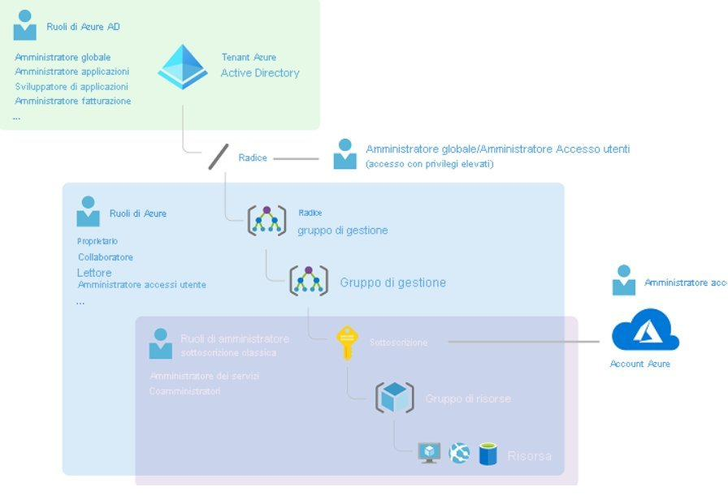 _(dimensioni: 895×598 px)_

*Figura 32 — Relazione tra ruoli di amministratore della sottoscrizione classica, ruoli di Azure e ruoli di Microsoft Entra nella gerarchia Management Group → Sottoscrizione → Gruppo di risorse → Risorsa. Gli ambiti figlio ereditano i ruoli assegnati all'ambito padre.* _(caption)_

**I tre elementi di un'assegnazione di ruolo** _(stepTitle)_

Per creare un'assegnazione di ruolo servono tre elementi — chi, cosa e dove:

**1. Entità di sicurezza — Chi**

L'oggetto a cui si concede l'accesso: utente, gruppo, entità servizio (applicazione) o identità gestita.

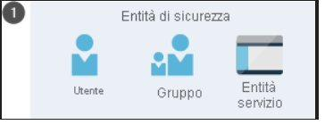 _(dimensioni: 357×134 px)_

*Figura 30 — Entità di sicurezza: utente, gruppo ed entità servizio (applicazione).* _(caption)_

**2. Definizione del ruolo — Cosa**

Una raccolta di autorizzazioni (talvolta chiamata semplicemente "ruolo") che elenca le operazioni consentite: lettura, scrittura, eliminazione e altro. I ruoli possono essere di livello superiore (es. Proprietario) o specifici (es. Collaboratore Macchina virtuale).

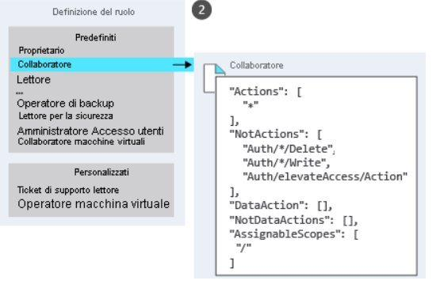 _(dimensioni: 537×352 px)_

*Figura 31 — Definizione del ruolo: elenco dei ruoli predefiniti e personalizzati con dettaglio del ruolo Collaboratore e delle sue autorizzazioni.* _(caption)_

I **quattro ruoli predefiniti fondamentali** sono:

| Ruolo | Descrizione |
|-------|-------------|
| **Proprietario** | Accesso completo a tutte le risorse, incluso il diritto di delegare l'accesso ad altri. |
| **Collaboratore** | Può creare e gestire tutti i tipi di risorse Azure, ma non può concedere l'accesso ad altri. |
| **Lettore** | Può solo visualizzare le risorse Azure esistenti, nessuna modifica. |
| **Amministratore Accesso Utenti** | Gestisce gli accessi utente alle risorse Azure, ma non può gestire le risorse stesse. |

Se i ruoli predefiniti non coprono le esigenze specifiche dell'organizzazione, è possibile creare **ruoli personalizzati**.

**3. Ambito — Dove**

Il livello a cui si applica l'accesso. In Azure è possibile specificare un ambito su quattro livelli, strutturati in una relazione padre-figlio: quando si concede l'accesso a un ambito padre, gli ambiti figlio ereditano automaticamente quelle autorizzazioni.

    Gruppo di gestione
    └── Sottoscrizione
        └── Gruppo di risorse
            └── Risorsa

Esempio: se a un gruppo viene assegnato il ruolo Collaboratore a livello di sottoscrizione, quel ruolo vale per tutti i gruppi di risorse e le risorse all'interno della sottoscrizione.

> **Assegnazione di ruolo**: Un'assegnazione di ruolo è il processo di associazione di un ruolo a un'entità di sicurezza in un ambito specifico. Per concedere l'accesso si crea un'assegnazione; per revocarlo si rimuove l'assegnazione. Nell'esempio: al gruppo Marketing è assegnato il ruolo Collaboratore sull'ambito del gruppo di risorse Sales — può gestire tutte le risorse di quel gruppo, ma non di altri gruppi.
_(infoBox)_

**RBAC è un modello additivo** _(stepTitle)_

Azure RBAC è un modello di **autorizzazione additivo**: le assegnazioni di ruolo si sommano. Se un utente ha il ruolo Lettore su un gruppo di risorse tramite un'assegnazione e il ruolo Collaboratore sullo stesso gruppo tramite un'altra assegnazione (ad es. per appartenenza a un gruppo), avrà entrambe le autorizzazioni combinate.

La definizione di ruolo usa due proprietà chiave:

- `Actions` — operazioni consentite sul **piano di controllo**. Il carattere jolly `*` indica tutte le operazioni.
- `NotActions` — operazioni da sottrarre dalle Actions. Le **autorizzazioni effettive** si calcolano come: `Actions − NotActions`.

Il ruolo **Collaboratore** usa `*` in Actions (può fare tutto), ma sottrae da NotActions le seguenti operazioni specifiche:

- Eliminare ruoli e assegnazioni di ruolo.
- Creare ruoli e assegnazioni di ruolo.
- Concedere al chiamante l'accesso di tipo Amministratore Accesso Utenti a livello del tenant.
- Creare o aggiornare artefatti di progetto (Azure Blueprints).
- Eliminare artefatti di progetto.

Risultato: il Collaboratore può gestire qualsiasi risorsa Azure, ma non può modificare chi ha accesso a cosa.

> **DataActions e NotDataActions**: Oltre a `Actions`/`NotActions` (piano di controllo), i ruoli possono includere `DataActions`/`NotDataActions` per le operazioni sul **piano dati** (es. leggere i blob di uno storage account, leggere segreti da Key Vault). Un ruolo con solo `Actions` non concede accesso al piano dati e viceversa.
_(infoBox)_

**RBAC nel portale Azure** _(stepTitle)_

In ogni risorsa, gruppo di risorse, sottoscrizione o gruppo di gestione è presente il riquadro **Controllo di accesso (IAM)** — noto anche come *Identity and Access Management*. Da qui è possibile:

- Visualizzare chi ha accesso e con quale ruolo.
- Aggiungere o rimuovere assegnazioni di ruolo.
- Verificare i propri permessi effettivi tramite la scheda "Verifica accesso".
- Visualizzare i log delle modifiche alle assegnazioni di ruolo nel log attività Azure.

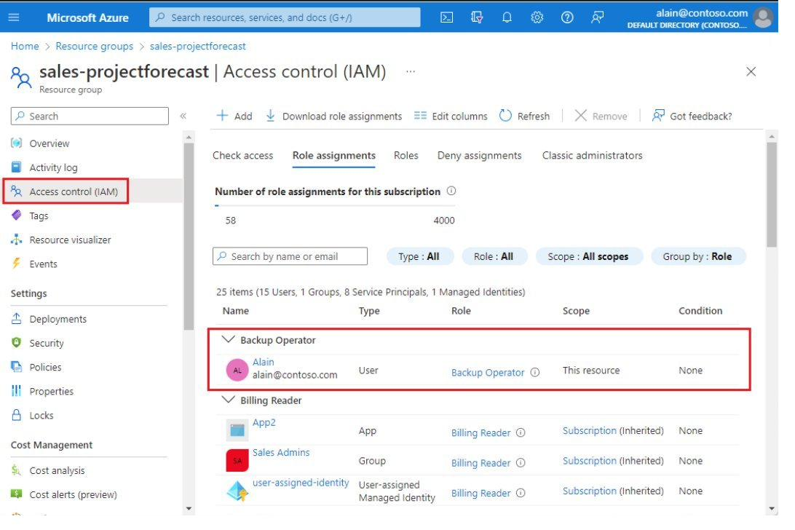 _(dimensioni: 1069×708 px)_

*Figura 33 — Riquadro Controllo di accesso (IAM) nel portale Azure: scheda Assegnazioni di ruolo con la lista di utenti, gruppi, service principal e managed identity con i relativi ruoli e ambiti.* _(caption)_

**Scenari pratici di utilizzo** _(stepTitle)_

- Consentire a un utente di gestire le macchine virtuali in una sottoscrizione e a un altro di gestire le reti virtuali nella stessa sottoscrizione.
- Consentire a un gruppo di amministratori di database di gestire i database SQL in una sottoscrizione.
- Consentire a un utente di gestire tutte le risorse in un gruppo di risorse — VM, siti Web, subnet.
- Consentire a un'applicazione di accedere a tutte le risorse in un gruppo di risorse tramite una Managed Identity.

> **RBAC vs Azure Policy**: RBAC controlla **chi** può fare **cosa** sulle risorse (autorizzazione). Azure Policy controlla **come** devono essere configurate le risorse (governance). RBAC può permettere a un utente di creare una VM; Azure Policy può impedire che venga creata in una regione non consentita. I due sistemi sono complementari e operano in sequenza: RBAC viene valutato prima, Azure Policy dopo.
_(infoBox)_

---

## 2.6 — Reimpostazione della password self-service (SSPR)
_(h2: Calibri 14pt grassetto #0078D4 keepNext)_

### 2.6.1 — Introduzione
_(h3: Calibri 12pt grassetto #2D5F8A keepNext)_

La reimpostazione della password self-service (SSPR) di Microsoft Entra consente agli utenti di cambiare o reimpostare la propria password senza intervento dell'amministratore o dell'help desk. In grandi organizzazioni il volume di richieste di reset è spesso molto alto e il personale IT dedica tempo prezioso a operazioni ripetitive a basso valore. SSPR risolve questo problema consentendo agli utenti di sbloccarsi in autonomia, da qualsiasi browser o dalla schermata di accesso Windows, riducendo sia i costi dell'help desk sia la perdita di produttività.

> **Nota sulle licenze**: Solo le sottoscrizioni a pagamento possono usare SSPR. Le sottoscrizioni gratuite e le sottoscrizioni "pay-as-you-go" non supportano questa funzionalità.
_(infoBox)_

**Obiettivi di apprendimento di questa sezione** _(stepTitle)_

- Decidere se e quando implementare SSPR nell'organizzazione.
- Scegliere l'ambito di distribuzione (pilota → tutti gli utenti).
- Configurare metodi di autenticazione, notifiche e personalizzazioni.
- Integrare SSPR con ambienti ibridi tramite password writeback.

### 2.6.2 — Come funziona la reimpostazione autonoma della password
_(h3: Calibri 12pt grassetto #2D5F8A keepNext)_

**Perché usare SSPR** _(stepTitle)_

In Microsoft Entra ID qualsiasi utente che abbia già eseguito l'accesso può modificare la password in autonomia. Se invece non ha mai eseguito l'accesso, la password è dimenticata, scaduta o bloccata, deve poterla reimpostare senza dover chiamare il supporto. Con SSPR gli utenti possono reimpostare la password tramite un browser Web o direttamente dalla schermata di accesso di Windows, ripristinando l'accesso ad Azure, Microsoft 365 e qualsiasi applicazione integrata con Microsoft Entra ID.

**I 5 step del processo SSPR** _(stepTitle)_

L'utente avvia il processo accedendo al portale di reimpostazione password oppure selezionando il collegamento **Non è possibile accedere all'account** nella pagina di accesso:

1. **Localizzazione** — il portale rileva le impostazioni locali del browser e mostra la pagina SSPR nella lingua appropriata.
2. **Verifica** — l'utente immette il proprio nome utente e supera un test CAPTCHA per dimostrare di essere un essere umano e non un robot.
3. **Autenticazione** — l'utente immette i dati necessari per il metodo di autenticazione registrato (codice OTP, notifica app, risposta a domanda di sicurezza, ecc.).
4. **Reimpostazione della password** — se l'autenticazione ha esito positivo, l'utente imposta una nuova password e la conferma.
5. **Notifica** — viene inviata una notifica all'utente per confermare che la reimpostazione è avvenuta con successo.

**Metodi di autenticazione supportati** _(stepTitle)_

Prima di poter usare SSPR, ogni utente deve registrare almeno un metodo di autenticazione. L'amministratore configura quanti metodi sono necessari (1 o 2) e quali sono disponibili. La tabella seguente riassume i sei metodi supportati:

| Metodo | Come registrarsi | Come autenticarsi per il reset |
|---|---|---|
| **Notifica dell'app per dispositivi mobili** | Installare Microsoft Authenticator e registrarla nella pagina di configurazione MFA | Azure invia una notifica all'app; l'utente la conferma o rifiuta |
| **Codice dell'app per dispositivi mobili** | Stesso processo — usare l'app Authenticator già installata | Immettere il codice OTP generato dall'app |
| **Email** | Specificare un indirizzo di posta elettronica esterno ad Azure e a Microsoft 365 | Azure invia un codice OTP all'indirizzo registrato |
| **Telefono cellulare** | Specificare un numero di cellulare | Azure invia un SMS con codice OTP; è possibile scegliere anche la chiamata automatica |
| **Telefono ufficio** | Specificare un numero fisso aziendale | Si riceve una chiamata automatica; premere # per confermare |
| **Domande di sicurezza** | Scegliere domande (es. "In quale città è nata tua madre?") e salvare le risposte | Rispondere correttamente alle domande durante il reset |

> **Organizzazioni in prova**: I metodi che richiedono una chiamata telefonica non sono supportati nei tenant Entra ID in prova gratuita.
_(infoBox)_

**Numero minimo di metodi richiesti** _(stepTitle)_

L'amministratore può configurare il numero minimo di metodi che l'utente deve aver registrato per poter usare SSPR: 1 o 2. Ad esempio, si possono abilitare quattro metodi (codice app, email, telefono ufficio, domande di sicurezza) e richiederne almeno 2. L'utente sceglie i due che preferisce. Un utente è considerato registrato per SSPR solo dopo aver registrato il numero minimo di metodi richiesti.

> **Attenzione**: Se si aumenta il numero minimo da 1 a 2, gli utenti che hanno registrato un solo metodo non possono più usare SSPR finché non ne registrano un secondo.
_(infoBox)_

Per il metodo con le domande di sicurezza, è possibile specificare separatamente quante domande l'utente deve configurare e quante deve rispondere correttamente per reimpostare la password.

**Consigli pratici sui metodi** _(stepTitle)_

- Abilitare sempre **due o più metodi** per garantire ridondanza se un metodo non è disponibile.
- Usare la **notifica dell'app per dispositivi mobili** come metodo primario — è il più sicuro e user-friendly.
- Abilitare anche **email o telefono ufficio** per supportare gli utenti senza smartphone.
- Il metodo **SMS è sconsigliato** come metodo esclusivo perché è vulnerabile agli attacchi di SIM swapping e SMS fraudolenti.
- Le **domande di sicurezza** sono il metodo meno sicuro — le risposte possono essere note ad altre persone. Usarle solo in combinazione con almeno un altro metodo.

**Account associati a ruoli di amministratore** _(stepTitle)_

Gli account con un ruolo di amministratore Entra ID sono soggetti a vincoli più severi rispetto agli utenti ordinari:

- I criteri a **due metodi** vengono sempre applicati agli account amministratore, indipendentemente dalla configurazione impostata per gli altri utenti.
- Il metodo delle **domande di sicurezza non è disponibile** per gli account con ruolo di amministratore.

**Configurare le notifiche** _(stepTitle)_

Dopo ogni reset, SSPR può inviare notifiche per avvisare l'utente e gli amministratori. Sono disponibili due opzioni:

- **Notifica agli utenti delle reimpostazioni delle password** — l'utente che ha eseguito il reset riceve una notifica agli indirizzi email primario e secondario. Se la reimpostazione è stata eseguita da un malintenzionato, questa notifica consente all'utente legittimo di accorgersene tempestivamente.
- **Notifica agli amministratori quando altri amministratori reimpostano la password** — tutti gli amministratori ricevono una notifica ogni volta che un altro amministratore reimposta la propria password. Questo fornisce un audit trail immediato per le azioni sensibili.

**Requisiti di licenza** _(stepTitle)_

La funzionalità disponibile dipende dall'edizione di Entra ID in uso:

| Scenario | Licenza richiesta |
|---|---|
| Modifica della password (utente già connesso) | Qualsiasi edizione, inclusa quella gratuita |
| Reset della password dimenticata o scaduta | Entra ID P1/P2, Microsoft 365 Apps for Business, o Microsoft 365 |
| Writeback delle password in ambienti ibridi | Entra ID P1/P2, o Microsoft 365 Apps per le aziende |

**Opzioni di distribuzione — Writeback delle password** _(stepTitle)_

Il writeback delle password può essere distribuito tramite due modalità, che possono coesistere in parallelo per set diversi di utenti:

- **Microsoft Entra Connect** — soluzione tradizionale, adatta agli ambienti ibridi già esistenti.
- **Sincronizzazione cloud** — offre maggiore disponibilità rispetto ad Entra Connect perché non dipende da una singola istanza. È la scelta raccomandata per i nuovi deployment ibridi.

Le due opzioni possono essere usate contemporaneamente su domini diversi, ad esempio per gestire utenti di aziende acquisite (fusioni o divisioni).

> **Confronto**: La sincronizzazione cloud è preferita per i nuovi deployment per l'alta disponibilità. Entra Connect rimane valida per ambienti legacy già configurati.
_(infoBox)_

### 2.6.3 — Implementare la reimpostazione della password self-service
_(h3: Calibri 12pt grassetto #2D5F8A keepNext)_

**Prerequisiti** _(stepTitle)_

Prima di configurare SSPR sono necessari:

- **Organizzazione Entra ID** con almeno una licenza di prova P1 o P2 abilitata.
- **Account con ruolo di Amministratore dei criteri di autenticazione** — per configurare SSPR nel portale.
- **Account utente non amministrativo** — per testare SSPR (Microsoft Entra applica requisiti aggiuntivi agli account amministrativi; è importante testare con un utente normale con licenza valida).
- **Gruppo di sicurezza per il pilota** — l'utente di test deve essere membro di questo gruppo, che si usa per limitare l'ambito dell'abilitazione iniziale.

**Ambito dell'implementazione** _(stepTitle)_

La proprietà "Reimpostazione della password self-service abilitata" ha tre valori:

- **Nessuno** — SSPR disabilitata per tutti gli utenti del tenant (valore predefinito).
- **Selezionato** — solo i membri del gruppo di sicurezza specificato possono usare SSPR. Ideale per un pilota controllato su un gruppo ristretto (es. 20 utenti marketing) prima di estendere a tutti.
- **Tutti** — tutti gli utenti del tenant Entra ID possono usare SSPR.

La strategia consigliata è: abilitare con **Selezionato** per validare la configurazione, poi passare a **Tutti** per il deployment generale.

**Configurazione passo per passo nel portale Azure** _(stepTitle)_

1. **Portale Azure** → **Microsoft Entra ID** → **Gestire** → **Reimpostazione password**.
2. **Proprietà** — abilitare SSPR e scegliere l'ambito (Nessuno / Selezionato / Tutti); se si sceglie Selezionato, specificare il gruppo di sicurezza.

 _(dimensioni: 1327×450 px)_
*Figura 34 — Pannello Proprietà SSPR: abilitazione e selezione del gruppo pilota.* _(caption)_

3. **Metodi di autenticazione** — scegliere quanti metodi sono richiesti (1 o 2) e quali metodi abilitare tra i sei disponibili.

 _(dimensioni: 1327×858 px)_
*Figura 35 — Pannello Metodi di autenticazione SSPR: numero richiesto e metodi disponibili.* _(caption)_

4. **Registrazione** — specificare se richiedere la registrazione al successivo accesso e con quale frequenza richiedere la riconferma delle informazioni di autenticazione.

 _(dimensioni: 1872×629 px)_
*Figura 36 — Opzioni di registrazione SSPR: richiesta automatica alla prima autenticazione e scadenza periodica.* _(caption)_

5. **Notifiche** — scegliere se inviare notifiche agli utenti e agli amministratori in caso di reset.

 _(dimensioni: 995×489 px)_
*Figura 37 — Impostazioni notifiche SSPR: avvisi all'utente e agli amministratori.* _(caption)_

6. **Personalizzazione** — specificare un indirizzo email o un URL di pagina Web dove gli utenti possono contattare il supporto aziendale.

 _(dimensioni: 1324×445 px)_
*Figura 38 — Personalizzazione SSPR: link all'help desk aziendale per gli utenti che non riescono ad autenticarsi.* _(caption)_

**Integrazione con ambienti ibridi — Password Writeback** _(stepTitle)_

In ambienti ibridi con AD DS on-premise, il writeback delle password sincronizza le reimpostazioni eseguite in Entra ID verso la directory locale. Senza writeback, gli utenti sincronizzati da AD DS non possono reimpostare la password tramite SSPR.

- **Writeback abilitato** — utenti federati, con autenticazione pass-through o con sincronizzazione dell'hash delle password possono reimpostare la password da Entra ID.
- **Writeback disabilitato** — questi utenti non possono usare SSPR e devono contattare l'amministratore per la reimpostazione locale.
- È possibile configurare separatamente il comportamento per sblocco dell'account e reimpostazione della password.

**SSPR per utenti B2B** _(stepTitle)_

La reimpostazione della password è supportata anche per gli utenti guest invitati tramite Entra B2B:

- **Guest con tenant Entra ID** — il reset segue la policy del tenant di appartenenza del partner.
- **Guest invitati tramite Entra B2B** — possono reimpostare la password usando l'email registrata durante l'invito.

> **Limitazione**: Gli account Microsoft personali (Hotmail, Outlook.com, Live.com) invitati come guest **non** possono usare SSPR di Microsoft Entra — devono usare il portale di recupero account Microsoft (account.microsoft.com).
_(infoBox)_
