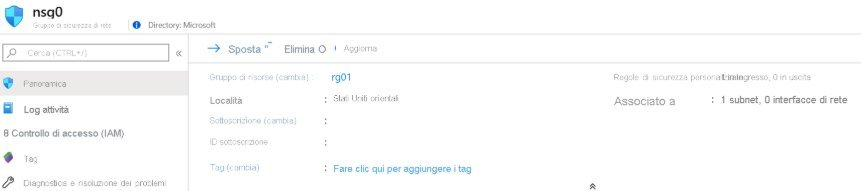
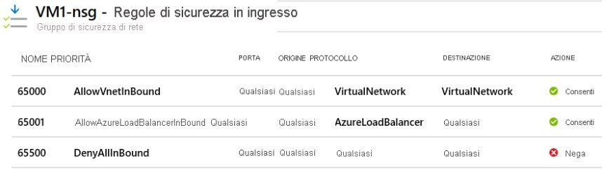
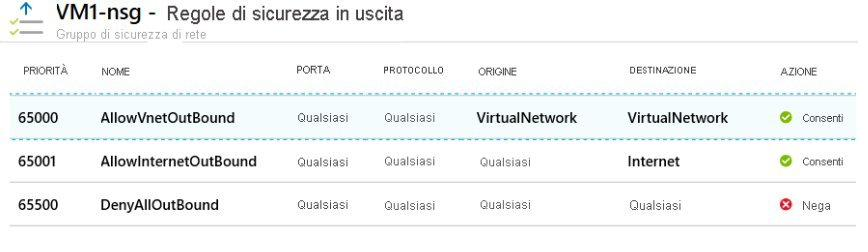
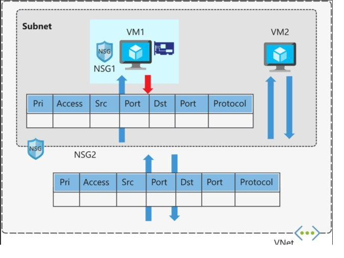
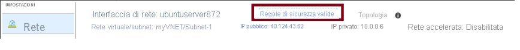
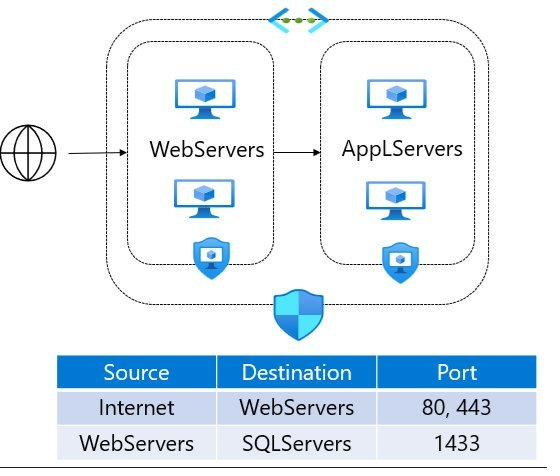
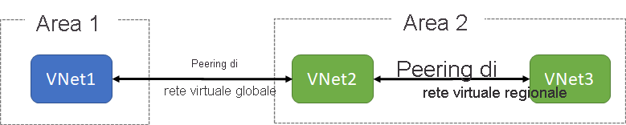
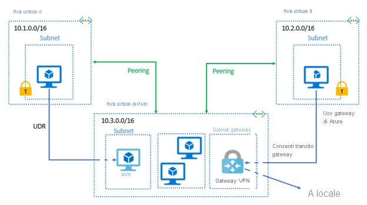
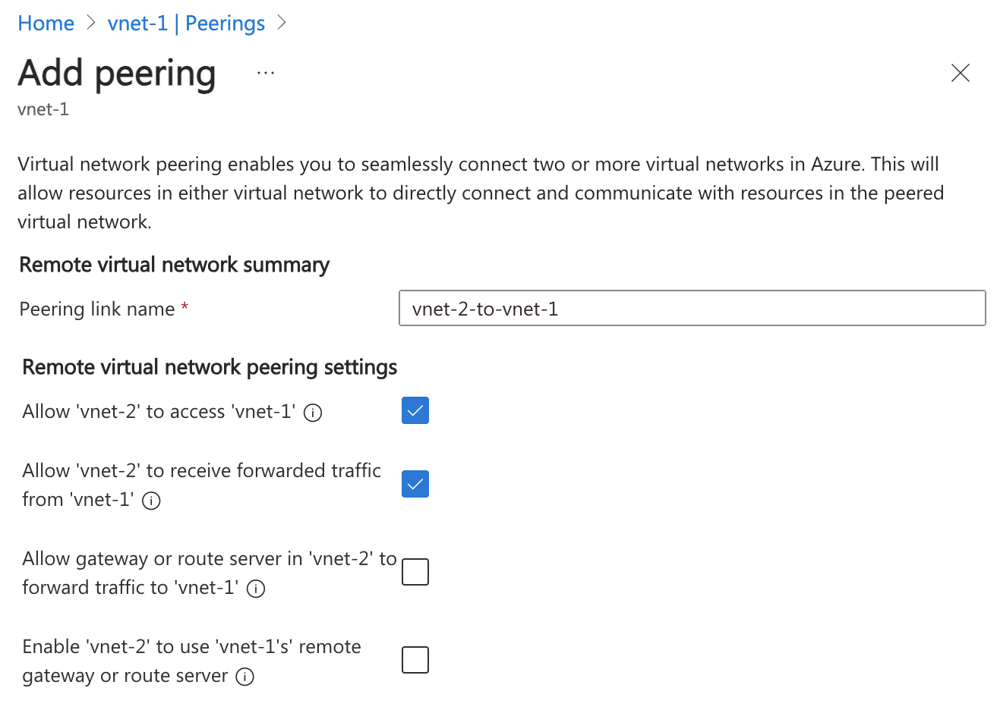
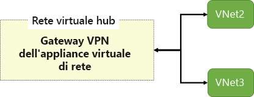

# Modulo 3 — Configurare e gestire reti virtuali per amministratori di Azure

_Questo percorso copre la progettazione e la gestione dell'infrastruttura di rete in Azure.
Una rete ben configurata garantisce connettività sicura, isolamento delle risorse e prestazioni ottimali._

**Immagini usate in questo modulo:**
- `img/ip-addressing.png` (850×138) — Figura 28
- `img/nsg-portal.png` (861×191) — Figura 29
- `img/nsg-inbound-rules.png` (858×247) — Figura 30
- `img/nsg-outbound-rules.png` (858×236) — Figura 31
- `img/nsg-multiple.png` (650×478) — Figura 32
- `img/nsg-effective-rules.png` (859×65) — Figura 33
- `img/asg-diagram.png` (320×274) — Figura 34

**Tabelle generate da codice:**
- `reservedTable()` — Tabella 3: Indirizzi riservati per subnet
- `publicIpAssocTable()` — Tabella 4: Associazione IP pubblici per tipo di risorsa
- `publicIpSkuTable()` — Tabella 5: Funzionalità SKU Standard IP pubblici
- `privateIpTable()` — Tabella 6: Risorse Azure che supportano IP privati
- `nsgRuleSettingsTable()` — Tabella 7: Impostazioni configurabili per una regola NSG

---

## 3.1 — Configurare reti virtuali
_(h2: Calibri 14pt grassetto #0078D4 keepNext)_

### 3.1.1 — Introduzione
_(h3: Calibri 12pt grassetto #2D5F8A keepNext)_

Le reti virtuali di Azure (VNet) sono il blocco fondamentale della rete privata in Azure. Consentono a molti tipi di risorse Azure di comunicare in modo sicuro tra loro, con Internet e con le reti locali on-premise. Una VNet è simile a una rete tradizionale operata in un datacenter fisico, ma offre i vantaggi aggiuntivi dell'infrastruttura cloud: scalabilità, disponibilità e isolamento.

### 3.1.2 — Pianificare le reti virtuali
_(h3: Calibri 12pt grassetto #2D5F8A keepNext)_

Prima di creare una VNet è necessario pianificarne attentamente la struttura. Ogni VNet ha uno spazio di indirizzi IP definito in notazione CIDR (es. `10.0.0.0/16`) che non può sovrapporsi con altri spazi di indirizzi nella stessa rete o con reti on-premise collegate.

**Scenari di utilizzo delle reti virtuali** _(stepTitle)_

- **Rete virtuale dedicata al cloud privato** — quando non è necessaria una configurazione cross-premise, i servizi e le VM nella VNet comunicano direttamente e in modo sicuro tra loro.
- **Estensione sicura del data center** — è possibile creare VPN site-to-site per ridimensionare in modo sicuro la capacità del data center. Le VPN site-to-site usano IPSec per fornire una connessione sicura tra il gateway VPN aziendale e Azure.
- **Scenari cloud ibridi** — le VNet offrono la flessibilità per connettere applicazioni cloud a qualsiasi tipo di sistema locale, inclusi mainframe e sistemi Unix, quando i blocchi CIDR delle reti non si sovrappongono.

**Considerazioni di progettazione** _(stepTitle)_

- Assicurarsi che lo spazio di indirizzi non si sovrapponga ad altri intervalli di rete dell'organizzazione.
- Azure riserva 5 indirizzi IP in ogni subnet: i primi 4 e l'ultimo.
- Una VNet appartiene a una sola regione Azure e a una sola sottoscrizione.
- Più VNet possono essere collegate tramite VNet Peering per comunicare tra loro.
- I DNS possono essere configurati a livello di VNet: si può usare il DNS di Azure (`168.63.129.16`) o DNS personalizzati.

> **Spazio di indirizzi privati**: Azure supporta gli spazi di indirizzi privati RFC 1918: `10.0.0.0/8`, `172.16.0.0/12` e `192.168.0.0/16`. È consigliabile usare questi range per le VNet aziendali.
_(infoBox)_

**Capire la notazione CIDR** _(stepTitle)_

Un indirizzo IPv4 è composto da 32 bit totali, scritti in 4 gruppi da 8 bit (es. `10.0.0.0`). Il numero dopo lo slash (`/`) indica quanti bit sono fissi per identificare la rete — i restanti bit sono liberi e identificano i singoli host.

- `10.0.0.0/16` → 16 bit fissi (10.0), 16 bit liberi → 2¹⁶ = 65.536 indirizzi, da 10.0.0.0 a 10.0.255.255
- `10.0.0.0/24` → 24 bit fissi (10.0.0), 8 bit liberi → 2⁸ = 256 indirizzi, da 10.0.0.0 a 10.0.0.255
- `10.0.0.0/28` → 28 bit fissi, 4 bit liberi → 2⁴ = 16 indirizzi

La formula generale è: `indirizzi disponibili = 2^(32 − prefisso)`. Più piccolo è il valore dopo lo `/`, più grande è la rete. I multipli di 8 (`/8`, `/16`, `/24`) sono i più comuni perché coincidono con i confini degli ottetti, ma valori come `/20`, `/22`, `/26` sono perfettamente validi.

> **Limite Azure per le subnet**: Azure riserva sempre 5 indirizzi per ogni subnet (i primi 4 e l'ultimo). Per questo il prefisso minimo consigliato per una subnet è `/28`, che garantisce 16 − 5 = 11 indirizzi utilizzabili.
_(infoBox)_

### 3.1.3 — Creare subnet
_(h3: Calibri 12pt grassetto #2D5F8A keepNext)_

Una subnet è una suddivisione dello spazio di indirizzi della VNet. Permette di segmentare la rete in sezioni più piccole per organizzare le risorse, migliorare la sicurezza, le prestazioni e semplificare la gestione. Ogni risorsa Azure in una VNet deve essere collocata in una subnet.

**Indirizzi riservati per ogni subnet** _(stepTitle)_

Per ogni subnet Azure riserva sempre 5 indirizzi IP che non possono essere assegnati alle risorse. Esempio con `192.168.1.0/24`:

[TABELLA: reservedTable] _(tabella generata da codice)_

*Tabella 3 — I 5 indirizzi riservati da Azure in ogni subnet (esempio con 192.168.1.0/24).* _(caption)_

**Considerazioni di progettazione** _(stepTitle)_

- Ogni subnet deve avere un intervallo CIDR univoco che rientra nello spazio di indirizzi della VNet padre.
- Gli intervalli delle subnet non possono sovrapporsi tra loro all'interno della stessa VNet.
- Alcune subnet speciali sono richieste da determinati servizi Azure: `GatewaySubnet` (per i gateway VPN/ExpressRoute), `AzureFirewallSubnet`, `AzureBastionSubnet`.
- **Appliance virtuali di rete (NVA)** — per default Azure instrada il traffico tra tutte le subnet della stessa VNet automaticamente. Se si vuole che il traffico passi attraverso una NVA (firewall virtuale, load balancer), le risorse devono essere collocate in subnet separate con routing personalizzato tramite Route Table.
- **Network Security Group (NSG)** — è possibile associare zero o un NSG a ogni subnet per filtrare il traffico in entrata e in uscita. Lo stesso NSG può essere associato a più subnet.
- **Azure Private Link** — permette connettività privata da una VNet a servizi PaaS (Storage, SQL, Key Vault, ecc.) senza esporre il traffico a Internet pubblico.

### 3.1.4 — Creare reti virtuali
_(h3: Calibri 12pt grassetto #2D5F8A keepNext)_

Una VNet può essere creata tramite il portale Azure, Azure CLI, PowerShell o template ARM. I parametri fondamentali sono il nome, la regione, la sottoscrizione, il gruppo di risorse e lo spazio di indirizzi.

**Creazione tramite Azure CLI** _(stepTitle)_

    az network vnet create \
      --resource-group rsg-1 \
      --name MyVNet \
      --address-prefix 10.0.0.0/16 \
      --subnet-name MySubnet \
      --subnet-prefix 10.0.0.0/24

### 3.1.5 — Pianificare l'indirizzamento IP
_(h3: Calibri 12pt grassetto #2D5F8A keepNext)_

In Azure gli indirizzi IP possono essere pubblici o privati, e assegnati in modo statico o dinamico.

 _(dimensioni: 850×138 px)_

*Figura 28 — Una risorsa Azure con indirizzo IP privato (comunicazione con VNet, reti locali, VPN Gateway, ExpressRoute) e indirizzo IP pubblico (comunicazione con Internet e servizi pubblici).* _(caption)_

**Indirizzi IP pubblici** _(stepTitle)_

- **Dinamici** — assegnati quando la risorsa viene avviata e rilasciati quando viene arrestata. L'indirizzo può cambiare a ogni riavvio.
- **Statici** — rimangono assegnati finché la risorsa esiste, indipendentemente dallo stato. Necessari per DNS, certificati TLS, firewall e scenari che richiedono un IP fisso.
- **SKU Basic** — supporta assegnazione dinamica e statica, non è ridondante per zona.
- **SKU Standard** — supporta solo assegnazione statica, è ridondante per zona per default, richiede NSG esplicito. Raccomandato per nuovi deployment.

**Indirizzi IP privati** _(stepTitle)_

- **Dinamici** — assegnati tramite DHCP dall'intervallo della subnet. Possono cambiare se la risorsa viene riallocata.
- **Statici** — l'amministratore specifica un indirizzo fisso nell'intervallo della subnet. Usati per DNS server, domain controller, firewall, database.

**Quando usare indirizzi IP statici** _(stepTitle)_

Gli IP statici sono necessari in questi scenari specifici:

- **Risoluzione dei nomi DNS** — una modifica dell'indirizzo IP richiederebbe l'aggiornamento manuale dei record host.
- **Modelli di sicurezza basati su IP** — app o servizi che devono essere sempre raggiungibili allo stesso indirizzo.
- **Certificati TLS/SSL** — i certificati sono spesso collegati a un indirizzo IP specifico.
- **Regole del firewall** — le regole che permettono o negano traffico in base a intervalli IP richiedono indirizzi stabili.
- **VM basate su ruolo** — controller di dominio, server DNS e altri server di infrastruttura devono avere sempre lo stesso indirizzo.

> **Best practice**: Usare indirizzi statici per tutte le risorse che fungono da server o che vengono referenziate da altri servizi tramite IP. Usare dinamici per VM client e workload temporanei.
_(infoBox)_

### 3.1.6 — Creare indirizzi IP pubblici
_(h3: Calibri 12pt grassetto #2D5F8A keepNext)_

Un indirizzo IP pubblico è una risorsa autonoma in Azure che può essere associata a vari tipi di risorse: VM, load balancer, gateway VPN, firewall. Si crea separatamente dalla risorsa a cui viene associato.

**Impostazioni da configurare alla creazione** _(stepTitle)_

- **Versione IP** — IPv4, IPv6 o dual-stack (entrambi). IPv4 e IPv6 vengono addebitati alla stessa tariffa.
- **SKU** — Basic o Standard. Lo SKU dell'IP pubblico deve corrispondere allo SKU del load balancer con cui viene usato. Raccomandato Standard per i nuovi deployment.
- **Livello (Tier)** — Regional (default) o Global. Un IP Global è usato con un bilanciatore di carico interregionale. Il livello dell'IP deve corrispondere al livello del load balancer associato.
- **Assegnazione** — Statica o Dinamica. Gli IP statici vengono assegnati al momento della creazione della risorsa IP pubblica e non vengono rilasciati finché la risorsa IP non viene eliminata esplicitamente.

**Note operative** _(stepTitle)_

- Gli IP pubblici Standard sono ridondanti per zona per default e supportano scenari di alta disponibilità.
- Un IP pubblico non associato ad alcuna risorsa genera comunque un costo.

### 3.1.7 — Associare indirizzi IP pubblici
_(h3: Calibri 12pt grassetto #2D5F8A keepNext)_

Un indirizzo IP pubblico può essere associato a diverse risorse Azure. Il punto di configurazione varia a seconda del tipo di risorsa:

[TABELLA: publicIpAssocTable] _(tabella generata da codice)_

*Tabella 4 — Come associare un IP pubblico in base al tipo di risorsa Azure.* _(caption)_

**Funzionalità dello SKU Standard** _(stepTitle)_

[TABELLA: publicIpSkuTable] _(tabella generata da codice)_

*Tabella 5 — Funzionalità dello SKU Standard per gli indirizzi IP pubblici.* _(caption)_

### 3.1.8 — Allocare o assegnare indirizzi IP privati
_(h3: Calibri 12pt grassetto #2D5F8A keepNext)_

Gli indirizzi IP privati vengono assegnati alle risorse che risiedono all'interno di una VNet. Le risorse con IP privato possono comunicare con altre risorse nella stessa VNet, con reti collegate tramite peering e con reti on-premise tramite VPN o ExpressRoute.

**Risorse che supportano IP privati** _(stepTitle)_

[TABELLA: privateIpTable] _(tabella generata da codice)_

*Tabella 6 — Risorse Azure che supportano indirizzi IP privati e modalità di assegnazione.* _(caption)_

**Metodi di assegnazione** _(stepTitle)_

- **Dinamico** — Azure assegna il prossimo indirizzo disponibile non assegnato o non riservato nell'intervallo della subnet. È il metodo predefinito. Esempio: se `10.0.0.4–10.0.0.9` sono già assegnati, Azure assegna `10.0.0.10` alla nuova risorsa.
- **Statico** — l'amministratore sceglie un indirizzo specifico disponibile nell'intervallo della subnet.

L'assegnazione statica è consigliata per: server DNS, domain controller, database, firewall e qualsiasi risorsa referenziata da altri servizi tramite IP fisso.

---

## 3.2 — Configurare i gruppi di sicurezza di rete
_(h2: Calibri 14pt grassetto #0078D4 keepNext)_

### 3.2.1 — Introduzione
_(h3: Calibri 12pt grassetto #2D5F8A keepNext)_

Un gruppo di sicurezza di rete (NSG) è un filtro del traffico di rete che consente o nega il traffico verso le risorse Azure. Ogni NSG contiene regole di sicurezza che valutano il traffico in entrata (inbound) e in uscita (outbound) in base a: protocollo, porta, indirizzo IP di origine e di destinazione. Un NSG può essere associato a una subnet, a una NIC o a entrambe.

### 3.2.2 — Implementare i gruppi di sicurezza di rete
_(h3: Calibri 12pt grassetto #2D5F8A keepNext)_

Gli NSG operano a livello di subnet e/o di interfaccia di rete (NIC). Possono essere associati a più subnet e NIC, ma una subnet o NIC può essere associata a un solo NSG alla volta.

**Come funzionano gli NSG** _(stepTitle)_

- **Traffico in entrata** — Azure valuta prima le regole dell'NSG associato alla subnet, poi quelle dell'NSG associato alla NIC.
- **Traffico in uscita** — Azure valuta prima le regole dell'NSG associato alla NIC, poi quelle dell'NSG associato alla subnet.
- Se nessun NSG è associato, tutto il traffico è consentito tra le risorse nella stessa VNet.
- Un NSG è una risorsa autonoma che può essere creata indipendentemente dalle subnet o NIC a cui verrà associato.

**NSG e subnet — zona DMZ** _(stepTitle)_

Assegnando un NSG a una subnet si crea una subnet protetta, detta anche zona demilitarizzata (DMZ). La DMZ funge da buffer tra le risorse interne alla VNet e Internet, consentendo solo il traffico esplicitamente autorizzato. Ogni subnet può avere al massimo un NSG associato.

**NSG e interfacce di rete** _(stepTitle)_

È possibile assegnare un NSG anche direttamente a una NIC per controllare tutto il traffico che transita attraverso quell'interfaccia. La pagina Panoramica di una VM nel portale mostra tutti gli NSG associati, le subnet e le NIC assegnate e le regole di sicurezza definite.

 _(dimensioni: 861×191 px)_

*Figura 29 — Panoramica di un NSG nel portale Azure: gruppo di risorse, località, subnet e interfacce di rete associati, regole personalizzate in entrata e in uscita.* _(caption)_

> **Best practice**: Associare NSG a livello di subnet anziché di singola NIC per una gestione più semplice e scalabile. Usare gli NSG a livello di NIC solo per casi eccezionali che richiedono regole differenziate per VM nella stessa subnet.
_(infoBox)_

### 3.2.3 — Determinare le regole dei gruppi di sicurezza di rete
_(h3: Calibri 12pt grassetto #2D5F8A keepNext)_

Ogni NSG contiene un insieme di regole di sicurezza predefinite che non possono essere eliminate, ma possono essere sostituite da regole personalizzate con priorità più alta. Ogni regola è definita da:

- **Nome** — identificatore univoco della regola nell'NSG.
- **Priorità** — numero tra 100 e 4096. Le regole vengono elaborate in ordine crescente di priorità. Una volta trovata una corrispondenza, l'elaborazione si ferma.
- **Origine/Destinazione** — indirizzo IP, intervallo CIDR, tag di servizio o gruppo di sicurezza delle applicazioni (ASG).
- **Protocollo** — TCP, UDP, ICMP, ESP, AH o Any.
- **Direzione** — Inbound o Outbound.
- **Intervallo di porte** — porta singola (es. 80), intervallo (es. 8080-8090) o wildcard (`*`).
- **Azione** — Allow o Deny.

> **Comportamento predefinito degli NSG**: Le regole predefinite negano tutto il traffico in entrata ad eccezione di quello proveniente dalla VNet e dal load balancer Azure. In uscita, consentono tutto il traffico verso la VNet e verso Internet. Qualsiasi traffico non coperto da una regola esplicita viene negato dalla regola DenyAll finale.
_(infoBox)_

**Tabella impostazioni configurabili per una regola** _(stepTitle)_

[TABELLA: nsgRuleSettingsTable] _(tabella generata da codice)_

*Tabella 7 — Impostazioni configurabili per una regola di sicurezza NSG.* _(caption)_

**Regole predefinite inbound** _(stepTitle)_

 _(dimensioni: 858×247 px)_

*Figura 30 — Regole di sicurezza in ingresso predefinite: AllowVnetInBound (65000), AllowAzureLoadBalancerInBound (65001), DenyAllInBound (65500).* _(caption)_

**Regole predefinite outbound** _(stepTitle)_

 _(dimensioni: 858×236 px)_

*Figura 31 — Regole di sicurezza in uscita predefinite: AllowVnetOutBound (65000), AllowInternetOutBound (65001), DenyAllOutBound (65500).* _(caption)_

### 3.2.4 — Determinare le regole effettive dei gruppi di sicurezza di rete
_(h3: Calibri 12pt grassetto #2D5F8A keepNext)_

Ogni NSG e le sue regole vengono valutati in modo indipendente. Azure elabora le condizioni di ogni regola per ogni VM nella configurazione.

- **Traffico in entrata** — Azure elabora prima le regole dell'NSG della subnet, poi quelle dell'NSG della NIC.
- **Traffico in uscita** — Azure elabora prima le regole dell'NSG della NIC, poi quelle dell'NSG della subnet.
- Azure considera anche il traffico intra-subnet: le regole dell'NSG associato a una subnet possono influire sul traffico tra VM nella stessa subnet.

 _(dimensioni: 650×478 px)_

*Figura 32 — Due NSG applicati a una subnet: NSG1 associato alla NIC di VM1 e NSG2 associato alla subnet. Ogni NSG viene valutato in modo indipendente per determinare le regole effettive.* _(caption)_

**Considerazioni per regole efficaci** _(stepTitle)_

- **Consentire tutto il traffico** — se non è necessario regolare il traffico verso una risorsa a un determinato livello, non associare un NSG a quel livello.
- **Importanza delle regole di autorizzazione** — se un NSG è associato sia alla subnet che alla NIC, occorre definire una regola Allow a entrambi i livelli. Se manca la regola Allow a uno dei livelli, il traffico viene bloccato.
- **Traffico intra-subnet** — le regole NSG della subnet si applicano anche al traffico tra VM nella stessa subnet.
- **Priorità delle regole** — assegnare valori di priorità con intervalli (100, 200, 300, ecc.) per poter inserire nuove regole in futuro senza dover rinumerare quelle esistenti.

**Visualizzare le regole di sicurezza effettive** _(stepTitle)_

Se sono presenti più NSG e non si è certi delle regole applicate, è possibile usare il collegamento **Regole di sicurezza valide** nel portale Azure. Si trova nella pagina della VM → Rete → Regole di sicurezza valide.

 _(dimensioni: 859×65 px)_

> **Network Watcher**: Azure Network Watcher offre una visualizzazione consolidata delle regole NSG. La funzionalità **IP Flow Verify** valuta il traffico rispetto alle regole effettive e indica se una connessione specifica verrebbe consentita o negata.
_(infoBox)_

### 3.2.5 — Creare regole del gruppo di sicurezza di rete
_(h3: Calibri 12pt grassetto #2D5F8A keepNext)_

Le regole NSG si creano dal portale Azure, PowerShell, CLI o template ARM. Ogni regola usa un approccio a 5 tuple per valutare il traffico: IP sorgente, porta sorgente, IP destinazione, porta destinazione e protocollo.

**Gli NSG sono stateful** _(stepTitle)_

Gli NSG sono dispositivi stateful: tengono traccia delle connessioni attive tramite flow record. Questo significa che se si crea una regola outbound sulla porta 80, non è necessario creare una regola inbound separata per il traffico di risposta — viene automaticamente consentito come parte della connessione stabilita.

> **Stateful vs Stateless**: Un firewall stateful ricorda le connessioni aperte. Un firewall stateless valuta ogni pacchetto in modo indipendente. Gli NSG Azure sono stateful — la risposta a una connessione consentita è sempre permessa, senza dover scrivere regole bidirezionali.
_(infoBox)_

**Creazione di regole — considerazioni** _(stepTitle)_

- Le regole con priorità più bassa (numero più piccolo) vengono elaborate prima e hanno precedenza.
- Non è possibile creare due regole con la stessa priorità nella stessa direzione.
- Usare il campo Servizio per selezionare protocolli predefiniti come RDP, SSH, HTTPS, oppure specificare porte personalizzate.
- Esempio — consentire traffico RDP (porta 3389) da un IP specifico: priorità 300, TCP, source `203.0.113.10`, dest `*`, porta 3389, Allow.
- Esempio — bloccare tutto il traffico HTTP in entrata: priorità 400, TCP, source `*`, dest `*`, porta 80, Deny.

**Tag di servizio** _(stepTitle)_

I tag di servizio sono identificatori predefiniti che rappresentano gruppi di prefissi IP di servizi Azure. Eliminano la necessità di aggiornare manualmente le regole quando cambiano gli indirizzi IP dei servizi. I più usati:

- `Internet` — tutti gli indirizzi IP pubblici esterni alla VNet.
- `VirtualNetwork` — tutto lo spazio di indirizzi della VNet e delle reti connesse.
- `AzureLoadBalancer` — indirizzo IP virtuale del load balancer Azure (`168.63.129.16`).
- `AzureCloud` — tutti gli indirizzi IP pubblici di Azure, inclusi i datacenter.
- `Storage`, `Sql`, `AzureActiveDirectory` — tag specifici per servizi Azure.

**Regole di sicurezza aumentate** _(stepTitle)_

Una singola regola NSG può contenere più valori nei campi Origine, Destinazione e Servizio:

- **Più indirizzi IP** — combinare più indirizzi IP o intervalli CIDR in una sola regola.
- **Più porte** — specificare più porte e intervalli nel campo Servizio (es. 80, 443, 8080-8090 in un'unica regola).
- **Mix di origine** — combinare tag di servizio, ASG e indirizzi IP all'interno della stessa regola.

> **Esempio pratico**: Invece di creare 4 regole separate per le porte 80, 443, 8080 e 8090, creare una sola regola con tutte le porte nel campo Servizio. In ambienti aziendali, le regole aumentate evitano la proliferazione delle regole NSG.
_(infoBox)_

### 3.2.6 — Implementare gruppi di sicurezza delle applicazioni
_(h3: Calibri 12pt grassetto #2D5F8A keepNext)_

I gruppi di sicurezza delle applicazioni (ASG) permettono di raggruppare le VM in base al ruolo applicativo e usare questi gruppi nelle regole NSG al posto di indirizzi IP specifici. Questo semplifica enormemente la gestione della sicurezza in ambienti con molte VM.

**Come funzionano gli ASG** _(stepTitle)_

- Si crea un ASG (es. `WebServers`, `AppServers`, `DbServers`) e si assegna a ogni NIC delle VM del gruppo.
- Nelle regole NSG si usa il nome dell'ASG come origine o destinazione al posto di indirizzi IP.
- Quando si aggiunge una nuova VM al gruppo, basta associare la NIC all'ASG — le regole NSG si applicano automaticamente senza modifiche.
- Una NIC può essere associata a più ASG. Un ASG può essere usato sia come origine che come destinazione nella stessa regola.

**Scenario di esempio — rivenditore online** _(stepTitle)_

Scenario con due livelli: `WebServers` (gestiscono traffico HTTP/HTTPS da Internet) e `AppLServers` (elaborano richieste SQL dai WebServers).

 _(dimensioni: 320×274 px)_

*Figura 34 — ASG applicati a una VNet: Internet accede ai WebServers su porte 80/443; i WebServers accedono agli AppLServers sulla porta SQL 1433.* _(caption)_

La configurazione richiede 3 regole NSG:

- **Regola 1** (priorità 100) — consenti traffico da Internet verso ASG `WebServers` su porte 80 e 443.
- **Regola 2** (priorità 110) — consenti traffico da ASG `WebServers` verso ASG `AppLServers` sulla porta 1433 (SQL).
- **Regola 3** (priorità 120) — nega tutto il traffico verso ASG `AppLServers` su porte 80 e 443. La combinazione di Regola 2 e Regola 3 garantisce che solo i WebServers possano raggiungere i server di database.

**Vantaggi degli ASG** _(stepTitle)_

- **Gestione degli indirizzi IP** — non è necessario specificare IP singoli nelle regole. Se una VM viene sostituita, basta aggiungere la NIC all'ASG senza toccare le regole NSG.
- **Nessun vincolo di subnet** — le VM possono essere organizzate logicamente per applicazione, indipendentemente dalla subnet in cui si trovano.
- **Regole semplificate** — una sola regola NSG copre tutte le VM dell'ASG.
- **Supporto dei carichi di lavoro** — la configurazione rispecchia la struttura applicativa (WebServers, AppServers, DbServers) rendendola più leggibile e manutenibile.

> **ASG vs tag di servizio**: I tag di servizio semplificano la gestione degli indirizzi IP per i servizi Azure gestiti (Storage, SQL, AzureCloud, ecc.). Gli ASG invece raggruppano le VM personalizzate. I due strumenti sono complementari e possono essere usati insieme nella stessa regola NSG.
_(infoBox)_

---

## 3.3 — Ospitare il dominio in DNS di Azure
_(h2: Calibri 14pt grassetto #0078D4 keepNext)_

### 3.3.1 — Introduzione
_(h3: Calibri 12pt grassetto #2D5F8A keepNext)_

DNS di Azure consente di ospitare i record DNS per i domini nell'infrastruttura di Azure, usando le stesse credenziali, API, strumenti e fatturazione degli altri servizi Azure.

Scenario tipico: un'azienda acquista un nome di dominio personalizzato (es. `wideworldimports.com`) da un registrar di terze parti e ha bisogno di un servizio di hosting DNS che risolva il dominio nell'indirizzo IP del server Web. DNS di Azure è la soluzione integrata in Azure per questo scopo.

**Obiettivi del modulo** _(stepTitle)_

- Configurare DNS di Azure per ospitare un dominio pubblico.
- Creare e configurare una zona DNS privata.
- Risolvere dinamicamente il nome di una risorsa Azure tramite record alias.

> **Prerequisito**: Conoscenza dei concetti di rete di base — risoluzione dei nomi e indirizzi IP.
_(infoBox)_

### 3.3.2 — Cos'è DNS di Azure?
_(h3: Calibri 12pt grassetto #2D5F8A keepNext)_

DNS (Domain Name System) è un protocollo TCP/IP che traduce nomi di dominio leggibili (es. `www.wideworldimports.com`) in indirizzi IP. È una directory distribuita ospitata su server in tutto il mondo.

**Le due funzioni principali di un server DNS** _(stepTitle)_

- **Cache locale** — mantiene una cache dei nomi usati di recente con i relativi IP. Se la risposta è in cache la restituisce subito, altrimenti passa la richiesta ad altri server DNS fino alla corrispondenza o al timeout.
- **Autorità su una zona** — gestisce il database delle coppie nome/IP per tutti gli host e sottodomini su cui ha autorità (Web, posta, altri servizi Internet del dominio).

**Processo di risoluzione di un nome** _(stepTitle)_

- Se il nome è in cache locale, il server DNS risponde direttamente.
- Se non è in cache, interroga altri server DNS fino a trovare una corrispondenza.
- Se non viene trovata risposta, restituisce un errore *impossibile trovare il dominio*.

**IPv4 e IPv6** _(stepTitle)_

- **IPv4** — quattro gruppi di numeri (0–255) separati da punto (es. `127.0.0.1`). Standard dominante, ma insufficiente per la crescita dei dispositivi IoT.
- **IPv6** — otto gruppi esadecimali separati da due punti (es. `fe80::e884:edb0:ddee:fea3`). Standard più recente, destinato a sostituire IPv4. DNS di Azure supporta entrambi.

**Tipi di record DNS** _(stepTitle)_

- **A** — mappa un dominio o nome host a un indirizzo IPv4. Tipo più comune.
- **AAAA** — analogo al record A ma per indirizzi IPv6.
- **CNAME** — nome canonico: crea un alias da un nome di dominio a un altro.
- **MX** — mail exchange: instrada il traffico e-mail verso il server di posta.
- **TXT** — associa stringhe di testo a un dominio. Usato da Azure e Microsoft 365 per verificare la proprietà del dominio.
- **NS** — server dei nomi: indica quali server DNS sono autorevoli per la zona. Creato automaticamente con la zona.
- **SOA** — Start of Authority: contiene informazioni amministrative sulla zona. Creato automaticamente.

Sono inoltre disponibili: **caratteri jolly** (coprono sottodomini non definiti), **CAA** (autorizza specifiche CA a emettere certificati), **SPF** (server autorizzati a inviare email, via TXT), **SRV** (host e porta per servizi specifici come VoIP).

> **Set di record**: Alcuni tipi (A, AAAA) supportano più valori in un unico record — detti set di record. Ad esempio un record A con due IP consente il bilanciamento del traffico:
>
>     www.wideworldimports.com.    3600    IN    A    127.0.0.1
>     www.wideworldimports.com.    3600    IN    A    127.0.0.2
>
> I record SOA e CNAME non possono avere set di record.
_(infoBox)_

**Cos'è DNS di Azure** _(stepTitle)_

DNS di Azure è un servizio di hosting per zone DNS basato sull'infrastruttura Microsoft Azure. Permette di gestire i record DNS dei propri domini con le stesse credenziali, fatturazione e contratto di supporto degli altri servizi Azure. Funge da origine di autorità (SOA) per il dominio.

> **Importante**: DNS di Azure NON consente di registrare nuovi nomi di dominio — questa operazione va effettuata presso un registrar di terze parti. DNS di Azure gestisce solo l'hosting e la risoluzione dei record per un dominio già registrato.
_(infoBox)_

**Vantaggi principali** _(stepTitle)_

- **Sicurezza** — RBAC per controllo granulare degli accessi, log attività per audit, blocco risorse per proteggere zone critiche.
- **Semplicità** — gestisce i record DNS per servizi Azure e risorse esterne tramite portale, PowerShell, CLI e API REST.
- **Zone DNS private** — risoluzione dei nomi per VM nelle VNet senza esporre i record su Internet. Supporta split-horizon DNS.
- **Record alias** — i record DNS puntano direttamente a risorse Azure e si aggiornano automaticamente al variare dell'IP.

> **Limitazione**: DNS di Azure non supporta DNSSEC. Se necessario, occorre ospitare quei componenti presso un provider di terze parti.
_(infoBox)_

### 3.3.3 — Configurare DNS di Azure per ospitare il dominio
_(h3: Calibri 12pt grassetto #2D5F8A keepNext)_

**Configurare una zona DNS pubblica** _(stepTitle)_

Una zona DNS pubblica ospita i record DNS di un dominio rendendoli visibili su Internet.

- **Passo 1** — Creare la zona DNS in Azure: nel portale Azure creare una nuova risorsa "Zona DNS" specificando sottoscrizione, gruppo di risorse e nome del dominio (es. `wideworldimports.com`).
- **Passo 2** — Ottenere i server DNS di Azure: dopo la creazione, Azure assegna quattro server dei nomi (record NS) alla zona.
- **Passo 3** — Aggiornare il registrar: sostituire i server dei nomi del registrar con i quattro forniti da Azure. Questa operazione si chiama *delega del dominio*.
- **Passo 4** — Verificare la delega con `nslookup`:

        nslookup -type=SOA wideworldimports.com

- **Passo 5** — Configurare i record personalizzati: aggiungere record A (nome host + TTL + IP) e record CNAME (es. `www` → `wideworldimports.com`, TTL 600s).

**Configurare una zona DNS privata** _(stepTitle)_

Le zone DNS private risolvono i nomi solo all'interno delle VNet collegate, senza esporre i record su Internet e senza richiedere un registrar.

- **Passo 1** — Creare la zona DNS privata: nel portale Azure cercare "Zone DNS private" e creare una nuova zona (es. `private.wideworldimports.com`).
- **Passo 2** — Identificare le reti virtuali: individuare le VNet in cui risiedono le VM che devono risolvere i nomi privati.
- **Passo 3** — Collegare la VNet alla zona privata: nella zona DNS privata selezionare **Collegamenti di rete virtuale → Aggiungi** e scegliere la VNet. Ripetere per ogni VNet.

> **Vantaggi delle zone private**: nessuna infrastruttura DNS dedicata, supporto per tutti i tipi di record (A, AAAA, CNAME, MX, TXT, SOA, PTR, SRV), aggiornamento automatico dei nomi host delle VM, supporto split-horizon DNS.
_(infoBox)_

### 3.3.4 — Risolvere dinamicamente il nome di una risorsa con un record alias
_(h3: Calibri 12pt grassetto #2D5F8A keepNext)_

**Il problema del dominio apex** _(stepTitle)_

Il dominio apex (o apice di zona) è il livello radice del dominio — es. `wideworldimports.com` senza prefissi. Viene indicato con il simbolo `@`. I record NS e SOA vengono creati automaticamente sull'apex.

I record CNAME non sono supportati a livello di apex di zona. Questo è un problema quando si vuole puntare il dominio radice a un servizio Azure come Traffic Manager o un CDN, che richiedono un nome anziché un IP fisso.

**Cosa sono i record alias** _(stepTitle)_

I record alias di Azure permettono a un record sull'apex di zona (tipo A, AAAA o CNAME) di fare riferimento direttamente a una risorsa Azure invece di un indirizzo IP statico. Il collegamento è dinamico: se l'IP della risorsa cambia, il record DNS si aggiorna automaticamente.

Le risorse Azure supportate dai record alias sono: Profilo di Traffic Manager, Endpoint di Azure CDN, Indirizzo IP pubblico di Azure, Profilo Azure Front Door.

**Vantaggi dei record alias** _(stepTitle)_

- **Impedisce il "dangling DNS"** — i record non rimangono a puntare a risorse eliminate o con IP cambiato, perché il ciclo di vita del record è legato alla risorsa Azure.
- **Aggiornamento automatico** — se l'IP sottostante cambia, tutti i record alias associati si aggiornano senza intervento manuale.
- **Bilanciamento del carico sull'apex** — consente di collegare `wideworldimports.com` direttamente a Traffic Manager.
- **Routing verso CDN** — consente di fare riferimento direttamente a un'istanza di Azure CDN.

> **Esempio pratico**: Un'azienda vuole che `wideworldimports.com` punti al proprio load balancer. Non si può usare un record A statico (l'IP può cambiare) né un CNAME sull'apex. La soluzione è un record alias di tipo A che punta all'indirizzo IP pubblico Azure o al profilo Traffic Manager associato al load balancer.
_(infoBox)_

---

## 3.4 — Configurare il peering di rete virtuale
_(h2: Calibri 14pt grassetto #0078D4 keepNext)_

### 3.4.1 — Introduzione
_(h3: Calibri 12pt grassetto #2D5F8A keepNext)_

Il peering di reti virtuali di Azure consente di connettere reti virtuali nella stessa area o in aree diverse, facendo comunicare le risorse in modo privato attraverso la rete backbone Microsoft, senza passare per Internet.

Scenario tipico: un'azienda sta migrando i propri servizi su Azure distribuendoli in reti virtuali separate. Le unità aziendali hanno bisogno che certi servizi comunichino tra loro privatamente, senza esporre traffico su Internet.

**Obiettivi del modulo** _(stepTitle)_

- Identificare i casi d'uso e le funzionalità del peering di reti virtuali di Azure.
- Configurare il Gateway VPN di Azure come punto di transito per la connettività tra reti.
- Estendere il peering tramite reti hub-spoke, route definite dall'utente e concatenamento dei servizi.

> **Prerequisito**: Conoscenza di base delle reti virtuali Azure e delle macchine virtuali.
_(infoBox)_

### 3.4.2 — Determinare gli usi del peering della rete virtuale
_(h3: Calibri 12pt grassetto #2D5F8A keepNext)_

Il peering di reti virtuali è il modo più semplice e rapido per connettere due reti virtuali Azure. Dopo il peering le due reti operano come un'unica rete ai fini della connettività.

**Tipi di peering** _(stepTitle)_

- **Peering a livello di area** — connette reti virtuali nella stessa area Azure (cloud pubblico, Azure Cina o Azure per enti pubblici).
- **Peering globale** — connette reti virtuali in aree diverse (solo cloud pubblico o Azure Cina; non consentito tra aree diverse di Azure per enti pubblici).

 _(dimensioni: 779×156 px)_

*Figura 40 — I due tipi di peering di reti virtuali Azure: peering a livello di area (stessa area) e peering globale (aree diverse).* _(caption)_

**Vantaggi** _(stepTitle)_

| Vantaggio | Descrizione |
| --- | --- |
| **Connessione privata** | Il traffico rimane sulla rete backbone Microsoft — nessun gateway, nessun Internet pubblico, nessuna crittografia richiesta. |
| **Alte prestazioni** | Bassa latenza e alta larghezza di banda grazie all'infrastruttura Azure. |
| **Comunicazione semplice** | Le risorse nelle reti con peering comunicano come se fossero sulla stessa rete. |
| **Trasferimento dati flessibile** | Supporta trasferimenti tra sottoscrizioni, modelli di distribuzione e aree diverse. |
| **Nessun downtime** | Il peering si crea e gestisce senza interruzioni per le risorse esistenti. |

**Requisiti e limitazioni** _(stepTitle)_

| Requisito / Limitazione | Descrizione |
| --- | --- |
| **Spazi indirizzi non sovrapposti** | Le reti con peering devono avere spazi IP non sovrapposti. Il peering fallisce in caso di sovrapposizione. |
| **Modifica dello spazio indirizzi** | Per modificare l'intervallo IP di una rete con peering attivo, eliminare il peering, aggiornare lo spazio e riconfigurare il peering. |
| **Load Balancer Basic** | Le risorse non possono comunicare con gli IP di un Load Balancer Basic interno nelle reti con peering globale. Usare Load Balancer Standard. |
| **Risoluzione DNS** | La risoluzione dei nomi predefinita di Azure non funziona tra reti con peering. Usare zone DNS private o server DNS personalizzati. |

> **Nota**: Le reti rimangono risorse separate dopo il peering. È possibile eseguire il peering tra sottoscrizioni e tenant diversi.
_(infoBox)_

### 3.4.3 — Determinare il transito e la connettività del gateway
_(h3: Calibri 12pt grassetto #2D5F8A keepNext)_

Il **Gateway VPN di Azure** può essere configurato come punto di transito in una rete hub: le reti spoke usano il gateway dell'hub per accedere a risorse esterne senza dover avere un proprio gateway VPN.

**Scenario tipico** _(stepTitle)_

- **Rete Hub** — contiene la subnet del gateway e il Gateway VPN di Azure.
- **Reti A e B** — entrambe in peering con l'Hub; la rete B usa il gateway remoto dell'Hub per accedere a risorse esterne (on-premises o altre VNet).

 _(dimensioni: 624×349 px)_

*Figura 41 — Peering a livello di area: la rete B usa il gateway VPN remoto dell'hub per accedere a risorse esterne senza un proprio gateway.* _(caption)_

**Impostazioni chiave nella configurazione del peering** _(stepTitle)_

| Impostazione | Descrizione |
| --- | --- |
| **Traffico verso la rete virtuale remota** | Controlla se il traffico può fluire da questa rete alla rete remota. |
| **Traffico inoltrato dalla rete virtuale remota** | Controlla se accettare traffico inoltrato (non originato) dalla rete con peering. |
| **Gateway di rete virtuale o Server di route** | Abilita il transito: consente alle reti con peering di usare il gateway VPN o il Route Server di questa rete. |
| **Gateway di rete virtuale remoto o Route Server** | Permette a questa rete di usare il gateway VPN o il Route Server della rete remota. |

 _(dimensioni: 1317×940 px)_

*Figura 42 — Opzioni di configurazione del peering nel portale Azure: traffico verso/da rete remota, gateway di rete virtuale e Route Server.* _(caption)_

**Caratteristiche del Gateway VPN con peering** _(stepTitle)_

- Una rete virtuale può avere **un solo** gateway VPN.
- Il transito è supportato sia per il peering a livello di area che globale.
- Con il transito abilitato, il gateway hub può gestire: VPN da sito a sito verso on-premises, connessioni VNet-to-VNet, VPN da punto a sito per client remoti.
- Le reti spoke condividono il gateway dell'hub senza bisogno di un gateway dedicato.

> **NSG e peering**: È possibile applicare gruppi di sicurezza di rete per bloccare o consentire il traffico tra reti con peering, anche dopo la creazione del peering.
_(infoBox)_

### 3.4.4 — Creare il peering di reti virtuali
_(h3: Calibri 12pt grassetto #2D5F8A keepNext)_

Il peering si configura tramite il portale Azure, PowerShell o l'interfaccia della riga di comando. I passaggi seguenti si riferiscono al portale Azure con reti distribuite tramite Azure Resource Manager.

**Prerequisiti** _(stepTitle)_

- L'account Azure deve avere il ruolo **Network Contributor** (o un ruolo personalizzato con le autorizzazioni di peering necessarie).
- Devono esistere due reti virtuali — la seconda è chiamata **rete remota**.
- Gli spazi indirizzi non devono sovrapporsi.

**Creare il peering dal portale** _(stepTitle)_

- **Passo 1** — Aprire la prima rete virtuale nel portale Azure e selezionare **Peering → Aggiungi**.
- **Passo 2** — Specificare un nome per il collegamento verso la rete remota e un nome per il collegamento inverso.
- **Passo 3** — Selezionare la rete virtuale remota (per sottoscrizione, ID risorsa o ricerca nel portale).
- **Passo 4** — Configurare le impostazioni di traffico e gateway in base alle esigenze.
- **Passo 5** — Confermare: Azure crea automaticamente entrambi i collegamenti (bidirezionale).

**Verificare lo stato del peering** _(stepTitle)_

- **Avviato** — il peering è stato creato dalla prima rete verso la remota, ma non è ancora bidirezionale.
- **Connesso** — entrambe le reti hanno stabilito il peering correttamente.

> **Importante**: Finché entrambe le reti non sono in stato **Connesso**, le macchine virtuali non possono comunicare tra loro.
_(infoBox)_

### 3.4.5 — Estendere il peering con route definite dall'utente e il concatenamento dei servizi
_(h3: Calibri 12pt grassetto #2D5F8A keepNext)_

Il peering di rete virtuale **non è transitivo**: se A è in peering con B e B è in peering con C, A e C non possono comunicare automaticamente. Per estendere la connettività oltre il peering diretto occorre usare meccanismi aggiuntivi.

**Meccanismi per estendere il peering** _(stepTitle)_

| Meccanismo | Descrizione |
| --- | --- |
| **Rete hub-spoke** | La rete hub ospita componenti condivisi (NVA, Gateway VPN). Tutte le reti spoke eseguono il peering verso l'hub. Il traffico tra spoke fluisce attraverso le appliance o il gateway nell'hub. |
| **Route definita dall'utente (UDR)** | Permette route personalizzate in cui l'hop successivo è l'IP di una VM o di un gateway VPN in una rete con peering, superando il routing predefinito. |
| **Concatenamento dei servizi** | Indirizza il traffico verso una NVA o un gateway tramite UDR che puntano a VM in reti con peering come hop successivo. |
| **Azure Virtual Network Manager** | Gestisce centralmente topologie hub-spoke o mesh su larga scala, automatizzando la creazione del peering. |

**Topologia hub-spoke** _(stepTitle)_

Nella topologia hub-spoke il traffico tra due reti spoke non scorre direttamente, ma transita sempre attraverso la rete hub dove risiedono le risorse condivise (NVA, firewall, gateway VPN). Questo centralizza il controllo e la sicurezza del traffico.

 _(dimensioni: 416×159 px)_

*Figura 43 — Rete hub-spoke con gateway VPN e NVA: le reti spoke raggiungono risorse esterne tramite route definite dall'utente e concatenamento dei servizi.* _(caption)_

> **Esempio**: La rete A vuole raggiungere la rete C. Entrambe sono in peering con l'hub B. Senza UDR la comunicazione non è possibile. Con una UDR che instrada il traffico di A verso la NVA nell'hub, il traffico transita per B e raggiunge C.
_(infoBox)_
